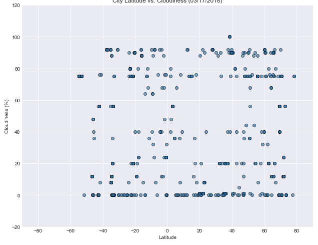
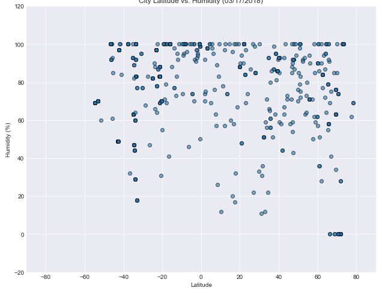
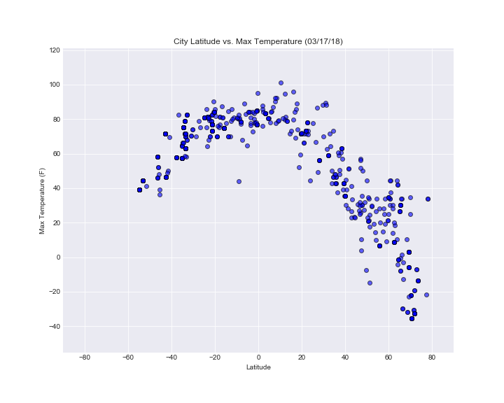
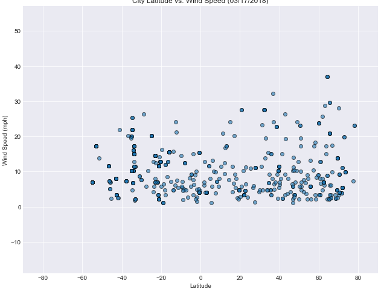

# HW6---Python-APIs


# WeatherPy

### Analysis

* __Observed Trend 1__: Although cities at Equator might not have the highest temperature, their temperatures remain high (around 80 F-Degree); North Sphere had more data when approaching the polar, this is due to the fact that there are barely any cities/countries existed passing the Antarctic Cirlcle (60ish degree) at the South Sphere. From the trend of "City Latitude vs. Max Temperature (03/17/18)" graph, the temperature climbs up when approaching from both side of the Polars to the Equator.
* __Observed Trend 2__: From graph "City Latitude vs Humidity (03/17/18)", humidities varies among cities even at the same Latitude. There are more than just latitude affecting the humidity (i.e. geographic location). However, we did saw that the humidity among cities around equator retain relatively moderate-to-high-humidity (40%-100%). This could mainly cause by the constant hot weather around equator area.  
* __Observed Trend 3__: From graph "City Latitude vs Wind Speed (03/17/18)", The wind speeds for cities around Equator below 20mph. However, temperature (due to the constantly high temperature around Equator) is just one of the many factors that affecting the Wind Speed. Thus the correlation might seems a bit low. 


```python
#Import dependencies
import pandas as pd
import numpy as np
import random
from citipy import citipy
import matplotlib.pyplot as plt
import seaborn as sns
import requests

#Import API Key for  
from config import key
```

## Generate Cities List


```python
#Latitudes range from -90 to 90.
#Longitudes range from -180 to 180.
# randomly select large pool of samples (10000) for Lat and Lon
# Later we can remove duplicates and randomly select another 500 sample from it
LatRand = np.random.choice(range(-90,90),10000)
LonRand = np.random.choice(range(-180,180),10000)

LatLon = pd.DataFrame({"Latitude":LatRand,"Longitude":LonRand})        
LatLon.head()
```


<div>
<style>
    .dataframe thead tr:only-child th {
        text-align: right;
    }

    .dataframe thead th {
        text-align: left;
    }

    .dataframe tbody tr th {
        vertical-align: top;
    }
</style>
<table border="1" class="dataframe">
  <thead>
    <tr style="text-align: right;">
      <th></th>
      <th>Latitude</th>
      <th>Longitude</th>
    </tr>
  </thead>
  <tbody>
    <tr>
      <th>0</th>
      <td>-29</td>
      <td>-106</td>
    </tr>
    <tr>
      <th>1</th>
      <td>55</td>
      <td>-170</td>
    </tr>
    <tr>
      <th>2</th>
      <td>56</td>
      <td>73</td>
    </tr>
    <tr>
      <th>3</th>
      <td>-17</td>
      <td>-91</td>
    </tr>
    <tr>
      <th>4</th>
      <td>-46</td>
      <td>158</td>
    </tr>
  </tbody>
</table>
</div>


```python
# For the selected coordinates, use citipy to associate them with nearest city.

LatLon["Closest City name"] = ""
LatLon["Closest Country code"] = ""
for index,row in LatLon.iterrows():
    city = citipy.nearest_city(row["Latitude"],row["Longitude"])
    LatLon.set_value(index,"Closest City name",city.city_name)
    LatLon.set_value(index,"Closest Country code",city.country_code.upper())
```


```python
# Per Instruction, There has to be at least 500 unique (non-repeat) cities 

# Remove any duplicate cities

ULatLon = LatLon.dropna()
ULatLon = ULatLon.drop_duplicates()

# Picking a sample of 666 cities to proceed with analysis
SampCities = ULatLon.sample(666)
SampCities =SampCities.reset_index()
SampCities = SampCities.iloc[:,[3,4]]
SampCities.head()
```


<div>
<style>
    .dataframe thead tr:only-child th {
        text-align: right;
    }

    .dataframe thead th {
        text-align: left;
    }

    .dataframe tbody tr th {
        vertical-align: top;
    }
</style>
<table border="1" class="dataframe">
  <thead>
    <tr style="text-align: right;">
      <th></th>
      <th>Closest City name</th>
      <th>Closest Country code</th>
    </tr>
  </thead>
  <tbody>
    <tr>
      <th>0</th>
      <td>saskylakh</td>
      <td>RU</td>
    </tr>
    <tr>
      <th>1</th>
      <td>yellowknife</td>
      <td>CA</td>
    </tr>
    <tr>
      <th>2</th>
      <td>russell</td>
      <td>NZ</td>
    </tr>
    <tr>
      <th>3</th>
      <td>saint george</td>
      <td>BM</td>
    </tr>
    <tr>
      <th>4</th>
      <td>mataura</td>
      <td>PF</td>
    </tr>
  </tbody>
</table>
</div>


## Perform API Calls


```python
# Perform a weather check on each of the cities using a series of successive API calls.
# Include a print log of each city as it's being processed with the city number, city name, and requested URL.

# Save config information
url = "http://api.openweathermap.org/data/2.5/weather?"
params = { "appid" :key,"units":"imperial" }

print("-----------------------------------------")
print("Beginning Data Retrieval")
print("-----------------------------------------\n")

# loop throught the Cities and append them to a dataframe
for index,row in SampCities.iterrows():
    params["q"] =f'{row["Closest City name"]},{row["Closest Country code"]}'
    print(f"Processing Record {index+1} of {len(SampCities)} | for City,Country: {params['q']}")
    CWResp = requests.get(url,params)
    print(CWResp.url)
    CWRespJson = CWResp.json()
#Sample Json Response
#{"coord":
#{"lon":145.77,"lat":-16.92},
#"weather":[{"id":803,"main":"Clouds","description":"broken clouds","icon":"04n"}],
#"base":"cmc stations",
#"main":{"temp":293.25,"pressure":1019,"humidity":83,"temp_min":289.82,"temp_max":295.37},
#"wind":{"speed":5.1,"deg":150},
#"clouds":{"all":75},
#"rain":{"3h":3},
#"dt":1435658272,
#"sys":{"type":1,"id":8166,"message":0.0166,"country":"AU","sunrise":1435610796,"sunset":1435650870},
#"id":2172797,
#"name":"Cairns",
#"cod":200}
    SampCities.set_value(index,"Latitude",CWRespJson.get("coord",{}).get("lat"))
    SampCities.set_value(index,"Longitude",CWRespJson.get("coord",{}).get("lon"))
    SampCities.set_value(index,"Temperature",CWRespJson.get("coord",{}).get("lon"))
    SampCities.set_value(index,"Max Temp",CWRespJson.get("main",{}).get("temp_max"))
    SampCities.set_value(index,"Wind speed",CWRespJson.get("wind",{}).get("speed"))
    SampCities.set_value(index,"Humidity",CWRespJson.get("main",{}).get("humidity"))
    SampCities.set_value(index,"Cloudiness",CWRespJson.get("clouds",{}).get("all"))
    SampCities.set_value(index,"Date",CWRespJson.get("dt"))


print("-----------------------------------------")
print("Data Retrieval Complete")
print("-----------------------------------------")

```

    -----------------------------------------
    Beginning Data Retrieval
    -----------------------------------------
    
    Processing Record 1 of 666 | for City,Country: saskylakh,RU
    http://api.openweathermap.org/data/2.5/weather?appid=cc3b48158ca4b5e8a383139b1415491f&units=imperial&q=saskylakh%2CRU
    Processing Record 2 of 666 | for City,Country: yellowknife,CA
    http://api.openweathermap.org/data/2.5/weather?appid=cc3b48158ca4b5e8a383139b1415491f&units=imperial&q=yellowknife%2CCA
    Processing Record 3 of 666 | for City,Country: russell,NZ
    http://api.openweathermap.org/data/2.5/weather?appid=cc3b48158ca4b5e8a383139b1415491f&units=imperial&q=russell%2CNZ
    Processing Record 4 of 666 | for City,Country: saint george,BM
    http://api.openweathermap.org/data/2.5/weather?appid=cc3b48158ca4b5e8a383139b1415491f&units=imperial&q=saint+george%2CBM
    Processing Record 5 of 666 | for City,Country: mataura,PF
    http://api.openweathermap.org/data/2.5/weather?appid=cc3b48158ca4b5e8a383139b1415491f&units=imperial&q=mataura%2CPF
    Processing Record 6 of 666 | for City,Country: margate,ZA
    http://api.openweathermap.org/data/2.5/weather?appid=cc3b48158ca4b5e8a383139b1415491f&units=imperial&q=margate%2CZA
    Processing Record 7 of 666 | for City,Country: meyungs,PW
    http://api.openweathermap.org/data/2.5/weather?appid=cc3b48158ca4b5e8a383139b1415491f&units=imperial&q=meyungs%2CPW
    Processing Record 8 of 666 | for City,Country: espanola,US
    http://api.openweathermap.org/data/2.5/weather?appid=cc3b48158ca4b5e8a383139b1415491f&units=imperial&q=espanola%2CUS
    Processing Record 9 of 666 | for City,Country: tuktoyaktuk,CA
    http://api.openweathermap.org/data/2.5/weather?appid=cc3b48158ca4b5e8a383139b1415491f&units=imperial&q=tuktoyaktuk%2CCA
    Processing Record 10 of 666 | for City,Country: avera,PF
    http://api.openweathermap.org/data/2.5/weather?appid=cc3b48158ca4b5e8a383139b1415491f&units=imperial&q=avera%2CPF
    Processing Record 11 of 666 | for City,Country: vaini,TO
    http://api.openweathermap.org/data/2.5/weather?appid=cc3b48158ca4b5e8a383139b1415491f&units=imperial&q=vaini%2CTO
    Processing Record 12 of 666 | for City,Country: east london,ZA
    http://api.openweathermap.org/data/2.5/weather?appid=cc3b48158ca4b5e8a383139b1415491f&units=imperial&q=east+london%2CZA
    Processing Record 13 of 666 | for City,Country: saint anthony,CA
    http://api.openweathermap.org/data/2.5/weather?appid=cc3b48158ca4b5e8a383139b1415491f&units=imperial&q=saint+anthony%2CCA
    Processing Record 14 of 666 | for City,Country: yellowknife,CA
    http://api.openweathermap.org/data/2.5/weather?appid=cc3b48158ca4b5e8a383139b1415491f&units=imperial&q=yellowknife%2CCA
    Processing Record 15 of 666 | for City,Country: avarua,CK
    http://api.openweathermap.org/data/2.5/weather?appid=cc3b48158ca4b5e8a383139b1415491f&units=imperial&q=avarua%2CCK
    Processing Record 16 of 666 | for City,Country: illoqqortoormiut,GL
    http://api.openweathermap.org/data/2.5/weather?appid=cc3b48158ca4b5e8a383139b1415491f&units=imperial&q=illoqqortoormiut%2CGL
    Processing Record 17 of 666 | for City,Country: agogo,GH
    http://api.openweathermap.org/data/2.5/weather?appid=cc3b48158ca4b5e8a383139b1415491f&units=imperial&q=agogo%2CGH
    Processing Record 18 of 666 | for City,Country: albany,AU
    http://api.openweathermap.org/data/2.5/weather?appid=cc3b48158ca4b5e8a383139b1415491f&units=imperial&q=albany%2CAU
    Processing Record 19 of 666 | for City,Country: tautira,PF
    http://api.openweathermap.org/data/2.5/weather?appid=cc3b48158ca4b5e8a383139b1415491f&units=imperial&q=tautira%2CPF
    Processing Record 20 of 666 | for City,Country: mataura,PF
    http://api.openweathermap.org/data/2.5/weather?appid=cc3b48158ca4b5e8a383139b1415491f&units=imperial&q=mataura%2CPF
    Processing Record 21 of 666 | for City,Country: caravelas,BR
    http://api.openweathermap.org/data/2.5/weather?appid=cc3b48158ca4b5e8a383139b1415491f&units=imperial&q=caravelas%2CBR
    Processing Record 22 of 666 | for City,Country: albany,AU
    http://api.openweathermap.org/data/2.5/weather?appid=cc3b48158ca4b5e8a383139b1415491f&units=imperial&q=albany%2CAU
    Processing Record 23 of 666 | for City,Country: novobelokatay,RU
    http://api.openweathermap.org/data/2.5/weather?appid=cc3b48158ca4b5e8a383139b1415491f&units=imperial&q=novobelokatay%2CRU
    Processing Record 24 of 666 | for City,Country: amderma,RU
    http://api.openweathermap.org/data/2.5/weather?appid=cc3b48158ca4b5e8a383139b1415491f&units=imperial&q=amderma%2CRU
    Processing Record 25 of 666 | for City,Country: wagar,SD
    http://api.openweathermap.org/data/2.5/weather?appid=cc3b48158ca4b5e8a383139b1415491f&units=imperial&q=wagar%2CSD
    Processing Record 26 of 666 | for City,Country: vaini,TO
    http://api.openweathermap.org/data/2.5/weather?appid=cc3b48158ca4b5e8a383139b1415491f&units=imperial&q=vaini%2CTO
    Processing Record 27 of 666 | for City,Country: kapaa,US
    http://api.openweathermap.org/data/2.5/weather?appid=cc3b48158ca4b5e8a383139b1415491f&units=imperial&q=kapaa%2CUS
    Processing Record 28 of 666 | for City,Country: taolanaro,MG
    http://api.openweathermap.org/data/2.5/weather?appid=cc3b48158ca4b5e8a383139b1415491f&units=imperial&q=taolanaro%2CMG
    Processing Record 29 of 666 | for City,Country: punta alta,AR
    http://api.openweathermap.org/data/2.5/weather?appid=cc3b48158ca4b5e8a383139b1415491f&units=imperial&q=punta+alta%2CAR
    Processing Record 30 of 666 | for City,Country: bluff,NZ
    http://api.openweathermap.org/data/2.5/weather?appid=cc3b48158ca4b5e8a383139b1415491f&units=imperial&q=bluff%2CNZ
    Processing Record 31 of 666 | for City,Country: grindavik,IS
    http://api.openweathermap.org/data/2.5/weather?appid=cc3b48158ca4b5e8a383139b1415491f&units=imperial&q=grindavik%2CIS
    Processing Record 32 of 666 | for City,Country: mount darwin,ZW
    http://api.openweathermap.org/data/2.5/weather?appid=cc3b48158ca4b5e8a383139b1415491f&units=imperial&q=mount+darwin%2CZW
    Processing Record 33 of 666 | for City,Country: puerto ayora,EC
    http://api.openweathermap.org/data/2.5/weather?appid=cc3b48158ca4b5e8a383139b1415491f&units=imperial&q=puerto+ayora%2CEC
    Processing Record 34 of 666 | for City,Country: tsihombe,MG
    http://api.openweathermap.org/data/2.5/weather?appid=cc3b48158ca4b5e8a383139b1415491f&units=imperial&q=tsihombe%2CMG
    Processing Record 35 of 666 | for City,Country: half moon bay,US
    http://api.openweathermap.org/data/2.5/weather?appid=cc3b48158ca4b5e8a383139b1415491f&units=imperial&q=half+moon+bay%2CUS
    Processing Record 36 of 666 | for City,Country: beringovskiy,RU
    http://api.openweathermap.org/data/2.5/weather?appid=cc3b48158ca4b5e8a383139b1415491f&units=imperial&q=beringovskiy%2CRU
    Processing Record 37 of 666 | for City,Country: kodiak,US
    http://api.openweathermap.org/data/2.5/weather?appid=cc3b48158ca4b5e8a383139b1415491f&units=imperial&q=kodiak%2CUS
    Processing Record 38 of 666 | for City,Country: grand river south east,MU
    http://api.openweathermap.org/data/2.5/weather?appid=cc3b48158ca4b5e8a383139b1415491f&units=imperial&q=grand+river+south+east%2CMU
    Processing Record 39 of 666 | for City,Country: belushya guba,RU
    http://api.openweathermap.org/data/2.5/weather?appid=cc3b48158ca4b5e8a383139b1415491f&units=imperial&q=belushya+guba%2CRU
    Processing Record 40 of 666 | for City,Country: port elizabeth,ZA
    http://api.openweathermap.org/data/2.5/weather?appid=cc3b48158ca4b5e8a383139b1415491f&units=imperial&q=port+elizabeth%2CZA
    Processing Record 41 of 666 | for City,Country: ushuaia,AR
    http://api.openweathermap.org/data/2.5/weather?appid=cc3b48158ca4b5e8a383139b1415491f&units=imperial&q=ushuaia%2CAR
    Processing Record 42 of 666 | for City,Country: antofagasta,CL
    http://api.openweathermap.org/data/2.5/weather?appid=cc3b48158ca4b5e8a383139b1415491f&units=imperial&q=antofagasta%2CCL
    Processing Record 43 of 666 | for City,Country: jamestown,SH
    http://api.openweathermap.org/data/2.5/weather?appid=cc3b48158ca4b5e8a383139b1415491f&units=imperial&q=jamestown%2CSH
    Processing Record 44 of 666 | for City,Country: mar del plata,AR
    http://api.openweathermap.org/data/2.5/weather?appid=cc3b48158ca4b5e8a383139b1415491f&units=imperial&q=mar+del+plata%2CAR
    Processing Record 45 of 666 | for City,Country: porto de moz,BR
    http://api.openweathermap.org/data/2.5/weather?appid=cc3b48158ca4b5e8a383139b1415491f&units=imperial&q=porto+de+moz%2CBR
    Processing Record 46 of 666 | for City,Country: hasaki,JP
    http://api.openweathermap.org/data/2.5/weather?appid=cc3b48158ca4b5e8a383139b1415491f&units=imperial&q=hasaki%2CJP
    Processing Record 47 of 666 | for City,Country: hithadhoo,MV
    http://api.openweathermap.org/data/2.5/weather?appid=cc3b48158ca4b5e8a383139b1415491f&units=imperial&q=hithadhoo%2CMV
    Processing Record 48 of 666 | for City,Country: victoria,SC
    http://api.openweathermap.org/data/2.5/weather?appid=cc3b48158ca4b5e8a383139b1415491f&units=imperial&q=victoria%2CSC
    Processing Record 49 of 666 | for City,Country: nishihara,JP
    http://api.openweathermap.org/data/2.5/weather?appid=cc3b48158ca4b5e8a383139b1415491f&units=imperial&q=nishihara%2CJP
    Processing Record 50 of 666 | for City,Country: clyde river,CA
    http://api.openweathermap.org/data/2.5/weather?appid=cc3b48158ca4b5e8a383139b1415491f&units=imperial&q=clyde+river%2CCA
    Processing Record 51 of 666 | for City,Country: hasaki,JP
    http://api.openweathermap.org/data/2.5/weather?appid=cc3b48158ca4b5e8a383139b1415491f&units=imperial&q=hasaki%2CJP
    Processing Record 52 of 666 | for City,Country: iqaluit,CA
    http://api.openweathermap.org/data/2.5/weather?appid=cc3b48158ca4b5e8a383139b1415491f&units=imperial&q=iqaluit%2CCA
    Processing Record 53 of 666 | for City,Country: hobart,AU
    http://api.openweathermap.org/data/2.5/weather?appid=cc3b48158ca4b5e8a383139b1415491f&units=imperial&q=hobart%2CAU
    Processing Record 54 of 666 | for City,Country: rikitea,PF
    http://api.openweathermap.org/data/2.5/weather?appid=cc3b48158ca4b5e8a383139b1415491f&units=imperial&q=rikitea%2CPF
    Processing Record 55 of 666 | for City,Country: sabinov,SK
    http://api.openweathermap.org/data/2.5/weather?appid=cc3b48158ca4b5e8a383139b1415491f&units=imperial&q=sabinov%2CSK
    Processing Record 56 of 666 | for City,Country: saldanha,ZA
    http://api.openweathermap.org/data/2.5/weather?appid=cc3b48158ca4b5e8a383139b1415491f&units=imperial&q=saldanha%2CZA
    Processing Record 57 of 666 | for City,Country: constitucion,MX
    http://api.openweathermap.org/data/2.5/weather?appid=cc3b48158ca4b5e8a383139b1415491f&units=imperial&q=constitucion%2CMX
    Processing Record 58 of 666 | for City,Country: belushya guba,RU
    http://api.openweathermap.org/data/2.5/weather?appid=cc3b48158ca4b5e8a383139b1415491f&units=imperial&q=belushya+guba%2CRU
    Processing Record 59 of 666 | for City,Country: ribeira grande,PT
    http://api.openweathermap.org/data/2.5/weather?appid=cc3b48158ca4b5e8a383139b1415491f&units=imperial&q=ribeira+grande%2CPT
    Processing Record 60 of 666 | for City,Country: butaritari,KI
    http://api.openweathermap.org/data/2.5/weather?appid=cc3b48158ca4b5e8a383139b1415491f&units=imperial&q=butaritari%2CKI
    Processing Record 61 of 666 | for City,Country: tuktoyaktuk,CA
    http://api.openweathermap.org/data/2.5/weather?appid=cc3b48158ca4b5e8a383139b1415491f&units=imperial&q=tuktoyaktuk%2CCA
    Processing Record 62 of 666 | for City,Country: cape town,ZA
    http://api.openweathermap.org/data/2.5/weather?appid=cc3b48158ca4b5e8a383139b1415491f&units=imperial&q=cape+town%2CZA
    Processing Record 63 of 666 | for City,Country: barrow,US
    http://api.openweathermap.org/data/2.5/weather?appid=cc3b48158ca4b5e8a383139b1415491f&units=imperial&q=barrow%2CUS
    Processing Record 64 of 666 | for City,Country: mataura,PF
    http://api.openweathermap.org/data/2.5/weather?appid=cc3b48158ca4b5e8a383139b1415491f&units=imperial&q=mataura%2CPF
    Processing Record 65 of 666 | for City,Country: nanortalik,GL
    http://api.openweathermap.org/data/2.5/weather?appid=cc3b48158ca4b5e8a383139b1415491f&units=imperial&q=nanortalik%2CGL
    Processing Record 66 of 666 | for City,Country: vila velha,BR
    http://api.openweathermap.org/data/2.5/weather?appid=cc3b48158ca4b5e8a383139b1415491f&units=imperial&q=vila+velha%2CBR
    Processing Record 67 of 666 | for City,Country: kenai,US
    http://api.openweathermap.org/data/2.5/weather?appid=cc3b48158ca4b5e8a383139b1415491f&units=imperial&q=kenai%2CUS
    Processing Record 68 of 666 | for City,Country: taolanaro,MG
    http://api.openweathermap.org/data/2.5/weather?appid=cc3b48158ca4b5e8a383139b1415491f&units=imperial&q=taolanaro%2CMG
    Processing Record 69 of 666 | for City,Country: castro,CL
    http://api.openweathermap.org/data/2.5/weather?appid=cc3b48158ca4b5e8a383139b1415491f&units=imperial&q=castro%2CCL
    Processing Record 70 of 666 | for City,Country: thompson,CA
    http://api.openweathermap.org/data/2.5/weather?appid=cc3b48158ca4b5e8a383139b1415491f&units=imperial&q=thompson%2CCA
    Processing Record 71 of 666 | for City,Country: vaini,TO
    http://api.openweathermap.org/data/2.5/weather?appid=cc3b48158ca4b5e8a383139b1415491f&units=imperial&q=vaini%2CTO
    Processing Record 72 of 666 | for City,Country: ilulissat,GL
    http://api.openweathermap.org/data/2.5/weather?appid=cc3b48158ca4b5e8a383139b1415491f&units=imperial&q=ilulissat%2CGL
    Processing Record 73 of 666 | for City,Country: kawana waters,AU
    http://api.openweathermap.org/data/2.5/weather?appid=cc3b48158ca4b5e8a383139b1415491f&units=imperial&q=kawana+waters%2CAU
    Processing Record 74 of 666 | for City,Country: thompson,CA
    http://api.openweathermap.org/data/2.5/weather?appid=cc3b48158ca4b5e8a383139b1415491f&units=imperial&q=thompson%2CCA
    Processing Record 75 of 666 | for City,Country: bredasdorp,ZA
    http://api.openweathermap.org/data/2.5/weather?appid=cc3b48158ca4b5e8a383139b1415491f&units=imperial&q=bredasdorp%2CZA
    Processing Record 76 of 666 | for City,Country: castro,CL
    http://api.openweathermap.org/data/2.5/weather?appid=cc3b48158ca4b5e8a383139b1415491f&units=imperial&q=castro%2CCL
    Processing Record 77 of 666 | for City,Country: ushuaia,AR
    http://api.openweathermap.org/data/2.5/weather?appid=cc3b48158ca4b5e8a383139b1415491f&units=imperial&q=ushuaia%2CAR
    Processing Record 78 of 666 | for City,Country: kapaa,US
    http://api.openweathermap.org/data/2.5/weather?appid=cc3b48158ca4b5e8a383139b1415491f&units=imperial&q=kapaa%2CUS
    Processing Record 79 of 666 | for City,Country: qaanaaq,GL
    http://api.openweathermap.org/data/2.5/weather?appid=cc3b48158ca4b5e8a383139b1415491f&units=imperial&q=qaanaaq%2CGL
    Processing Record 80 of 666 | for City,Country: rikitea,PF
    http://api.openweathermap.org/data/2.5/weather?appid=cc3b48158ca4b5e8a383139b1415491f&units=imperial&q=rikitea%2CPF
    Processing Record 81 of 666 | for City,Country: castro,CL
    http://api.openweathermap.org/data/2.5/weather?appid=cc3b48158ca4b5e8a383139b1415491f&units=imperial&q=castro%2CCL
    Processing Record 82 of 666 | for City,Country: hofn,IS
    http://api.openweathermap.org/data/2.5/weather?appid=cc3b48158ca4b5e8a383139b1415491f&units=imperial&q=hofn%2CIS
    Processing Record 83 of 666 | for City,Country: hithadhoo,MV
    http://api.openweathermap.org/data/2.5/weather?appid=cc3b48158ca4b5e8a383139b1415491f&units=imperial&q=hithadhoo%2CMV
    Processing Record 84 of 666 | for City,Country: tuktoyaktuk,CA
    http://api.openweathermap.org/data/2.5/weather?appid=cc3b48158ca4b5e8a383139b1415491f&units=imperial&q=tuktoyaktuk%2CCA
    Processing Record 85 of 666 | for City,Country: damara,CF
    http://api.openweathermap.org/data/2.5/weather?appid=cc3b48158ca4b5e8a383139b1415491f&units=imperial&q=damara%2CCF
    Processing Record 86 of 666 | for City,Country: punta arenas,CL
    http://api.openweathermap.org/data/2.5/weather?appid=cc3b48158ca4b5e8a383139b1415491f&units=imperial&q=punta+arenas%2CCL
    Processing Record 87 of 666 | for City,Country: bonavista,CA
    http://api.openweathermap.org/data/2.5/weather?appid=cc3b48158ca4b5e8a383139b1415491f&units=imperial&q=bonavista%2CCA
    Processing Record 88 of 666 | for City,Country: garissa,KE
    http://api.openweathermap.org/data/2.5/weather?appid=cc3b48158ca4b5e8a383139b1415491f&units=imperial&q=garissa%2CKE
    Processing Record 89 of 666 | for City,Country: mys shmidta,RU
    http://api.openweathermap.org/data/2.5/weather?appid=cc3b48158ca4b5e8a383139b1415491f&units=imperial&q=mys+shmidta%2CRU
    Processing Record 90 of 666 | for City,Country: georgetown,SH
    http://api.openweathermap.org/data/2.5/weather?appid=cc3b48158ca4b5e8a383139b1415491f&units=imperial&q=georgetown%2CSH
    Processing Record 91 of 666 | for City,Country: kenai,US
    http://api.openweathermap.org/data/2.5/weather?appid=cc3b48158ca4b5e8a383139b1415491f&units=imperial&q=kenai%2CUS
    Processing Record 92 of 666 | for City,Country: clyde river,CA
    http://api.openweathermap.org/data/2.5/weather?appid=cc3b48158ca4b5e8a383139b1415491f&units=imperial&q=clyde+river%2CCA
    Processing Record 93 of 666 | for City,Country: guerrero negro,MX
    http://api.openweathermap.org/data/2.5/weather?appid=cc3b48158ca4b5e8a383139b1415491f&units=imperial&q=guerrero+negro%2CMX
    Processing Record 94 of 666 | for City,Country: zhuanghe,CN
    http://api.openweathermap.org/data/2.5/weather?appid=cc3b48158ca4b5e8a383139b1415491f&units=imperial&q=zhuanghe%2CCN
    Processing Record 95 of 666 | for City,Country: ushuaia,AR
    http://api.openweathermap.org/data/2.5/weather?appid=cc3b48158ca4b5e8a383139b1415491f&units=imperial&q=ushuaia%2CAR
    Processing Record 96 of 666 | for City,Country: albany,AU
    http://api.openweathermap.org/data/2.5/weather?appid=cc3b48158ca4b5e8a383139b1415491f&units=imperial&q=albany%2CAU
    Processing Record 97 of 666 | for City,Country: punta arenas,CL
    http://api.openweathermap.org/data/2.5/weather?appid=cc3b48158ca4b5e8a383139b1415491f&units=imperial&q=punta+arenas%2CCL
    Processing Record 98 of 666 | for City,Country: nemuro,JP
    http://api.openweathermap.org/data/2.5/weather?appid=cc3b48158ca4b5e8a383139b1415491f&units=imperial&q=nemuro%2CJP
    Processing Record 99 of 666 | for City,Country: vaini,TO
    http://api.openweathermap.org/data/2.5/weather?appid=cc3b48158ca4b5e8a383139b1415491f&units=imperial&q=vaini%2CTO
    Processing Record 100 of 666 | for City,Country: zharkent,KZ
    http://api.openweathermap.org/data/2.5/weather?appid=cc3b48158ca4b5e8a383139b1415491f&units=imperial&q=zharkent%2CKZ
    Processing Record 101 of 666 | for City,Country: yellowknife,CA
    http://api.openweathermap.org/data/2.5/weather?appid=cc3b48158ca4b5e8a383139b1415491f&units=imperial&q=yellowknife%2CCA
    Processing Record 102 of 666 | for City,Country: kaeo,NZ
    http://api.openweathermap.org/data/2.5/weather?appid=cc3b48158ca4b5e8a383139b1415491f&units=imperial&q=kaeo%2CNZ
    Processing Record 103 of 666 | for City,Country: aloleng,PH
    http://api.openweathermap.org/data/2.5/weather?appid=cc3b48158ca4b5e8a383139b1415491f&units=imperial&q=aloleng%2CPH
    Processing Record 104 of 666 | for City,Country: guerrero negro,MX
    http://api.openweathermap.org/data/2.5/weather?appid=cc3b48158ca4b5e8a383139b1415491f&units=imperial&q=guerrero+negro%2CMX
    Processing Record 105 of 666 | for City,Country: opuwo,NA
    http://api.openweathermap.org/data/2.5/weather?appid=cc3b48158ca4b5e8a383139b1415491f&units=imperial&q=opuwo%2CNA
    Processing Record 106 of 666 | for City,Country: jamestown,SH
    http://api.openweathermap.org/data/2.5/weather?appid=cc3b48158ca4b5e8a383139b1415491f&units=imperial&q=jamestown%2CSH
    Processing Record 107 of 666 | for City,Country: marsh harbour,BS
    http://api.openweathermap.org/data/2.5/weather?appid=cc3b48158ca4b5e8a383139b1415491f&units=imperial&q=marsh+harbour%2CBS
    Processing Record 108 of 666 | for City,Country: tumaco,CO
    http://api.openweathermap.org/data/2.5/weather?appid=cc3b48158ca4b5e8a383139b1415491f&units=imperial&q=tumaco%2CCO
    Processing Record 109 of 666 | for City,Country: kaeo,NZ
    http://api.openweathermap.org/data/2.5/weather?appid=cc3b48158ca4b5e8a383139b1415491f&units=imperial&q=kaeo%2CNZ
    Processing Record 110 of 666 | for City,Country: mataura,PF
    http://api.openweathermap.org/data/2.5/weather?appid=cc3b48158ca4b5e8a383139b1415491f&units=imperial&q=mataura%2CPF
    Processing Record 111 of 666 | for City,Country: bredasdorp,ZA
    http://api.openweathermap.org/data/2.5/weather?appid=cc3b48158ca4b5e8a383139b1415491f&units=imperial&q=bredasdorp%2CZA
    Processing Record 112 of 666 | for City,Country: mataura,PF
    http://api.openweathermap.org/data/2.5/weather?appid=cc3b48158ca4b5e8a383139b1415491f&units=imperial&q=mataura%2CPF
    Processing Record 113 of 666 | for City,Country: arraial do cabo,BR
    http://api.openweathermap.org/data/2.5/weather?appid=cc3b48158ca4b5e8a383139b1415491f&units=imperial&q=arraial+do+cabo%2CBR
    Processing Record 114 of 666 | for City,Country: langxiang,CN
    http://api.openweathermap.org/data/2.5/weather?appid=cc3b48158ca4b5e8a383139b1415491f&units=imperial&q=langxiang%2CCN
    Processing Record 115 of 666 | for City,Country: port elizabeth,ZA
    http://api.openweathermap.org/data/2.5/weather?appid=cc3b48158ca4b5e8a383139b1415491f&units=imperial&q=port+elizabeth%2CZA
    Processing Record 116 of 666 | for City,Country: ushuaia,AR
    http://api.openweathermap.org/data/2.5/weather?appid=cc3b48158ca4b5e8a383139b1415491f&units=imperial&q=ushuaia%2CAR
    Processing Record 117 of 666 | for City,Country: ushuaia,AR
    http://api.openweathermap.org/data/2.5/weather?appid=cc3b48158ca4b5e8a383139b1415491f&units=imperial&q=ushuaia%2CAR
    Processing Record 118 of 666 | for City,Country: khatanga,RU
    http://api.openweathermap.org/data/2.5/weather?appid=cc3b48158ca4b5e8a383139b1415491f&units=imperial&q=khatanga%2CRU
    Processing Record 119 of 666 | for City,Country: hilo,US
    http://api.openweathermap.org/data/2.5/weather?appid=cc3b48158ca4b5e8a383139b1415491f&units=imperial&q=hilo%2CUS
    Processing Record 120 of 666 | for City,Country: rikitea,PF
    http://api.openweathermap.org/data/2.5/weather?appid=cc3b48158ca4b5e8a383139b1415491f&units=imperial&q=rikitea%2CPF
    Processing Record 121 of 666 | for City,Country: chegdomyn,RU
    http://api.openweathermap.org/data/2.5/weather?appid=cc3b48158ca4b5e8a383139b1415491f&units=imperial&q=chegdomyn%2CRU
    Processing Record 122 of 666 | for City,Country: chagda,RU
    http://api.openweathermap.org/data/2.5/weather?appid=cc3b48158ca4b5e8a383139b1415491f&units=imperial&q=chagda%2CRU
    Processing Record 123 of 666 | for City,Country: coihaique,CL
    http://api.openweathermap.org/data/2.5/weather?appid=cc3b48158ca4b5e8a383139b1415491f&units=imperial&q=coihaique%2CCL
    Processing Record 124 of 666 | for City,Country: provideniya,RU
    http://api.openweathermap.org/data/2.5/weather?appid=cc3b48158ca4b5e8a383139b1415491f&units=imperial&q=provideniya%2CRU
    Processing Record 125 of 666 | for City,Country: ushuaia,AR
    http://api.openweathermap.org/data/2.5/weather?appid=cc3b48158ca4b5e8a383139b1415491f&units=imperial&q=ushuaia%2CAR
    Processing Record 126 of 666 | for City,Country: hambantota,LK
    http://api.openweathermap.org/data/2.5/weather?appid=cc3b48158ca4b5e8a383139b1415491f&units=imperial&q=hambantota%2CLK
    Processing Record 127 of 666 | for City,Country: port alfred,ZA
    http://api.openweathermap.org/data/2.5/weather?appid=cc3b48158ca4b5e8a383139b1415491f&units=imperial&q=port+alfred%2CZA
    Processing Record 128 of 666 | for City,Country: jamestown,SH
    http://api.openweathermap.org/data/2.5/weather?appid=cc3b48158ca4b5e8a383139b1415491f&units=imperial&q=jamestown%2CSH
    Processing Record 129 of 666 | for City,Country: thompson,CA
    http://api.openweathermap.org/data/2.5/weather?appid=cc3b48158ca4b5e8a383139b1415491f&units=imperial&q=thompson%2CCA
    Processing Record 130 of 666 | for City,Country: punta arenas,CL
    http://api.openweathermap.org/data/2.5/weather?appid=cc3b48158ca4b5e8a383139b1415491f&units=imperial&q=punta+arenas%2CCL
    Processing Record 131 of 666 | for City,Country: egvekinot,RU
    http://api.openweathermap.org/data/2.5/weather?appid=cc3b48158ca4b5e8a383139b1415491f&units=imperial&q=egvekinot%2CRU
    Processing Record 132 of 666 | for City,Country: ilulissat,GL
    http://api.openweathermap.org/data/2.5/weather?appid=cc3b48158ca4b5e8a383139b1415491f&units=imperial&q=ilulissat%2CGL
    Processing Record 133 of 666 | for City,Country: guerrero negro,MX
    http://api.openweathermap.org/data/2.5/weather?appid=cc3b48158ca4b5e8a383139b1415491f&units=imperial&q=guerrero+negro%2CMX
    Processing Record 134 of 666 | for City,Country: ambon,ID
    http://api.openweathermap.org/data/2.5/weather?appid=cc3b48158ca4b5e8a383139b1415491f&units=imperial&q=ambon%2CID
    Processing Record 135 of 666 | for City,Country: albany,AU
    http://api.openweathermap.org/data/2.5/weather?appid=cc3b48158ca4b5e8a383139b1415491f&units=imperial&q=albany%2CAU
    Processing Record 136 of 666 | for City,Country: megion,RU
    http://api.openweathermap.org/data/2.5/weather?appid=cc3b48158ca4b5e8a383139b1415491f&units=imperial&q=megion%2CRU
    Processing Record 137 of 666 | for City,Country: atambua,ID
    http://api.openweathermap.org/data/2.5/weather?appid=cc3b48158ca4b5e8a383139b1415491f&units=imperial&q=atambua%2CID
    Processing Record 138 of 666 | for City,Country: ocos,GT
    http://api.openweathermap.org/data/2.5/weather?appid=cc3b48158ca4b5e8a383139b1415491f&units=imperial&q=ocos%2CGT
    Processing Record 139 of 666 | for City,Country: portland,AU
    http://api.openweathermap.org/data/2.5/weather?appid=cc3b48158ca4b5e8a383139b1415491f&units=imperial&q=portland%2CAU
    Processing Record 140 of 666 | for City,Country: illoqqortoormiut,GL
    http://api.openweathermap.org/data/2.5/weather?appid=cc3b48158ca4b5e8a383139b1415491f&units=imperial&q=illoqqortoormiut%2CGL
    Processing Record 141 of 666 | for City,Country: dubenskiy,RU
    http://api.openweathermap.org/data/2.5/weather?appid=cc3b48158ca4b5e8a383139b1415491f&units=imperial&q=dubenskiy%2CRU
    Processing Record 142 of 666 | for City,Country: puerto ayora,EC
    http://api.openweathermap.org/data/2.5/weather?appid=cc3b48158ca4b5e8a383139b1415491f&units=imperial&q=puerto+ayora%2CEC
    Processing Record 143 of 666 | for City,Country: skjervoy,NO
    http://api.openweathermap.org/data/2.5/weather?appid=cc3b48158ca4b5e8a383139b1415491f&units=imperial&q=skjervoy%2CNO
    Processing Record 144 of 666 | for City,Country: busselton,AU
    http://api.openweathermap.org/data/2.5/weather?appid=cc3b48158ca4b5e8a383139b1415491f&units=imperial&q=busselton%2CAU
    Processing Record 145 of 666 | for City,Country: namatanai,PG
    http://api.openweathermap.org/data/2.5/weather?appid=cc3b48158ca4b5e8a383139b1415491f&units=imperial&q=namatanai%2CPG
    Processing Record 146 of 666 | for City,Country: castro,CL
    http://api.openweathermap.org/data/2.5/weather?appid=cc3b48158ca4b5e8a383139b1415491f&units=imperial&q=castro%2CCL
    Processing Record 147 of 666 | for City,Country: arraial do cabo,BR
    http://api.openweathermap.org/data/2.5/weather?appid=cc3b48158ca4b5e8a383139b1415491f&units=imperial&q=arraial+do+cabo%2CBR
    Processing Record 148 of 666 | for City,Country: mataura,PF
    http://api.openweathermap.org/data/2.5/weather?appid=cc3b48158ca4b5e8a383139b1415491f&units=imperial&q=mataura%2CPF
    Processing Record 149 of 666 | for City,Country: emba,KZ
    http://api.openweathermap.org/data/2.5/weather?appid=cc3b48158ca4b5e8a383139b1415491f&units=imperial&q=emba%2CKZ
    Processing Record 150 of 666 | for City,Country: lang son,VN
    http://api.openweathermap.org/data/2.5/weather?appid=cc3b48158ca4b5e8a383139b1415491f&units=imperial&q=lang+son%2CVN
    Processing Record 151 of 666 | for City,Country: tuatapere,NZ
    http://api.openweathermap.org/data/2.5/weather?appid=cc3b48158ca4b5e8a383139b1415491f&units=imperial&q=tuatapere%2CNZ
    Processing Record 152 of 666 | for City,Country: tsihombe,MG
    http://api.openweathermap.org/data/2.5/weather?appid=cc3b48158ca4b5e8a383139b1415491f&units=imperial&q=tsihombe%2CMG
    Processing Record 153 of 666 | for City,Country: kapaa,US
    http://api.openweathermap.org/data/2.5/weather?appid=cc3b48158ca4b5e8a383139b1415491f&units=imperial&q=kapaa%2CUS
    Processing Record 154 of 666 | for City,Country: anito,PH
    http://api.openweathermap.org/data/2.5/weather?appid=cc3b48158ca4b5e8a383139b1415491f&units=imperial&q=anito%2CPH
    Processing Record 155 of 666 | for City,Country: mattru,SL
    http://api.openweathermap.org/data/2.5/weather?appid=cc3b48158ca4b5e8a383139b1415491f&units=imperial&q=mattru%2CSL
    Processing Record 156 of 666 | for City,Country: cerro cama,PA
    http://api.openweathermap.org/data/2.5/weather?appid=cc3b48158ca4b5e8a383139b1415491f&units=imperial&q=cerro+cama%2CPA
    Processing Record 157 of 666 | for City,Country: ushuaia,AR
    http://api.openweathermap.org/data/2.5/weather?appid=cc3b48158ca4b5e8a383139b1415491f&units=imperial&q=ushuaia%2CAR
    Processing Record 158 of 666 | for City,Country: burnie,AU
    http://api.openweathermap.org/data/2.5/weather?appid=cc3b48158ca4b5e8a383139b1415491f&units=imperial&q=burnie%2CAU
    Processing Record 159 of 666 | for City,Country: rikitea,PF
    http://api.openweathermap.org/data/2.5/weather?appid=cc3b48158ca4b5e8a383139b1415491f&units=imperial&q=rikitea%2CPF
    Processing Record 160 of 666 | for City,Country: hofn,IS
    http://api.openweathermap.org/data/2.5/weather?appid=cc3b48158ca4b5e8a383139b1415491f&units=imperial&q=hofn%2CIS
    Processing Record 161 of 666 | for City,Country: dmitriyev-lgovskiy,RU
    http://api.openweathermap.org/data/2.5/weather?appid=cc3b48158ca4b5e8a383139b1415491f&units=imperial&q=dmitriyev-lgovskiy%2CRU
    Processing Record 162 of 666 | for City,Country: juneau,US
    http://api.openweathermap.org/data/2.5/weather?appid=cc3b48158ca4b5e8a383139b1415491f&units=imperial&q=juneau%2CUS
    Processing Record 163 of 666 | for City,Country: rikitea,PF
    http://api.openweathermap.org/data/2.5/weather?appid=cc3b48158ca4b5e8a383139b1415491f&units=imperial&q=rikitea%2CPF
    Processing Record 164 of 666 | for City,Country: ushuaia,AR
    http://api.openweathermap.org/data/2.5/weather?appid=cc3b48158ca4b5e8a383139b1415491f&units=imperial&q=ushuaia%2CAR
    Processing Record 165 of 666 | for City,Country: ilulissat,GL
    http://api.openweathermap.org/data/2.5/weather?appid=cc3b48158ca4b5e8a383139b1415491f&units=imperial&q=ilulissat%2CGL
    Processing Record 166 of 666 | for City,Country: coahuayana,MX
    http://api.openweathermap.org/data/2.5/weather?appid=cc3b48158ca4b5e8a383139b1415491f&units=imperial&q=coahuayana%2CMX
    Processing Record 167 of 666 | for City,Country: lebu,CL
    http://api.openweathermap.org/data/2.5/weather?appid=cc3b48158ca4b5e8a383139b1415491f&units=imperial&q=lebu%2CCL
    Processing Record 168 of 666 | for City,Country: cabo san lucas,MX
    http://api.openweathermap.org/data/2.5/weather?appid=cc3b48158ca4b5e8a383139b1415491f&units=imperial&q=cabo+san+lucas%2CMX
    Processing Record 169 of 666 | for City,Country: busselton,AU
    http://api.openweathermap.org/data/2.5/weather?appid=cc3b48158ca4b5e8a383139b1415491f&units=imperial&q=busselton%2CAU
    Processing Record 170 of 666 | for City,Country: lorengau,PG
    http://api.openweathermap.org/data/2.5/weather?appid=cc3b48158ca4b5e8a383139b1415491f&units=imperial&q=lorengau%2CPG
    Processing Record 171 of 666 | for City,Country: cape town,ZA
    http://api.openweathermap.org/data/2.5/weather?appid=cc3b48158ca4b5e8a383139b1415491f&units=imperial&q=cape+town%2CZA
    Processing Record 172 of 666 | for City,Country: lolua,TV
    http://api.openweathermap.org/data/2.5/weather?appid=cc3b48158ca4b5e8a383139b1415491f&units=imperial&q=lolua%2CTV
    Processing Record 173 of 666 | for City,Country: vaini,TO
    http://api.openweathermap.org/data/2.5/weather?appid=cc3b48158ca4b5e8a383139b1415491f&units=imperial&q=vaini%2CTO
    Processing Record 174 of 666 | for City,Country: evensk,RU
    http://api.openweathermap.org/data/2.5/weather?appid=cc3b48158ca4b5e8a383139b1415491f&units=imperial&q=evensk%2CRU
    Processing Record 175 of 666 | for City,Country: kodiak,US
    http://api.openweathermap.org/data/2.5/weather?appid=cc3b48158ca4b5e8a383139b1415491f&units=imperial&q=kodiak%2CUS
    Processing Record 176 of 666 | for City,Country: zeya,RU
    http://api.openweathermap.org/data/2.5/weather?appid=cc3b48158ca4b5e8a383139b1415491f&units=imperial&q=zeya%2CRU
    Processing Record 177 of 666 | for City,Country: lompoc,US
    http://api.openweathermap.org/data/2.5/weather?appid=cc3b48158ca4b5e8a383139b1415491f&units=imperial&q=lompoc%2CUS
    Processing Record 178 of 666 | for City,Country: fukue,JP
    http://api.openweathermap.org/data/2.5/weather?appid=cc3b48158ca4b5e8a383139b1415491f&units=imperial&q=fukue%2CJP
    Processing Record 179 of 666 | for City,Country: tingi,TZ
    http://api.openweathermap.org/data/2.5/weather?appid=cc3b48158ca4b5e8a383139b1415491f&units=imperial&q=tingi%2CTZ
    Processing Record 180 of 666 | for City,Country: jamestown,SH
    http://api.openweathermap.org/data/2.5/weather?appid=cc3b48158ca4b5e8a383139b1415491f&units=imperial&q=jamestown%2CSH
    Processing Record 181 of 666 | for City,Country: jamestown,SH
    http://api.openweathermap.org/data/2.5/weather?appid=cc3b48158ca4b5e8a383139b1415491f&units=imperial&q=jamestown%2CSH
    Processing Record 182 of 666 | for City,Country: punta arenas,CL
    http://api.openweathermap.org/data/2.5/weather?appid=cc3b48158ca4b5e8a383139b1415491f&units=imperial&q=punta+arenas%2CCL
    Processing Record 183 of 666 | for City,Country: hobart,AU
    http://api.openweathermap.org/data/2.5/weather?appid=cc3b48158ca4b5e8a383139b1415491f&units=imperial&q=hobart%2CAU
    Processing Record 184 of 666 | for City,Country: cape town,ZA
    http://api.openweathermap.org/data/2.5/weather?appid=cc3b48158ca4b5e8a383139b1415491f&units=imperial&q=cape+town%2CZA
    Processing Record 185 of 666 | for City,Country: carnarvon,AU
    http://api.openweathermap.org/data/2.5/weather?appid=cc3b48158ca4b5e8a383139b1415491f&units=imperial&q=carnarvon%2CAU
    Processing Record 186 of 666 | for City,Country: san patricio,MX
    http://api.openweathermap.org/data/2.5/weather?appid=cc3b48158ca4b5e8a383139b1415491f&units=imperial&q=san+patricio%2CMX
    Processing Record 187 of 666 | for City,Country: turayf,SA
    http://api.openweathermap.org/data/2.5/weather?appid=cc3b48158ca4b5e8a383139b1415491f&units=imperial&q=turayf%2CSA
    Processing Record 188 of 666 | for City,Country: thompson,CA
    http://api.openweathermap.org/data/2.5/weather?appid=cc3b48158ca4b5e8a383139b1415491f&units=imperial&q=thompson%2CCA
    Processing Record 189 of 666 | for City,Country: hilo,US
    http://api.openweathermap.org/data/2.5/weather?appid=cc3b48158ca4b5e8a383139b1415491f&units=imperial&q=hilo%2CUS
    Processing Record 190 of 666 | for City,Country: rikitea,PF
    http://api.openweathermap.org/data/2.5/weather?appid=cc3b48158ca4b5e8a383139b1415491f&units=imperial&q=rikitea%2CPF
    Processing Record 191 of 666 | for City,Country: hobart,AU
    http://api.openweathermap.org/data/2.5/weather?appid=cc3b48158ca4b5e8a383139b1415491f&units=imperial&q=hobart%2CAU
    Processing Record 192 of 666 | for City,Country: busselton,AU
    http://api.openweathermap.org/data/2.5/weather?appid=cc3b48158ca4b5e8a383139b1415491f&units=imperial&q=busselton%2CAU
    Processing Record 193 of 666 | for City,Country: puerto ayora,EC
    http://api.openweathermap.org/data/2.5/weather?appid=cc3b48158ca4b5e8a383139b1415491f&units=imperial&q=puerto+ayora%2CEC
    Processing Record 194 of 666 | for City,Country: smolenka,RU
    http://api.openweathermap.org/data/2.5/weather?appid=cc3b48158ca4b5e8a383139b1415491f&units=imperial&q=smolenka%2CRU
    Processing Record 195 of 666 | for City,Country: ushuaia,AR
    http://api.openweathermap.org/data/2.5/weather?appid=cc3b48158ca4b5e8a383139b1415491f&units=imperial&q=ushuaia%2CAR
    Processing Record 196 of 666 | for City,Country: louisbourg,CA
    http://api.openweathermap.org/data/2.5/weather?appid=cc3b48158ca4b5e8a383139b1415491f&units=imperial&q=louisbourg%2CCA
    Processing Record 197 of 666 | for City,Country: nanortalik,GL
    http://api.openweathermap.org/data/2.5/weather?appid=cc3b48158ca4b5e8a383139b1415491f&units=imperial&q=nanortalik%2CGL
    Processing Record 198 of 666 | for City,Country: comodoro rivadavia,AR
    http://api.openweathermap.org/data/2.5/weather?appid=cc3b48158ca4b5e8a383139b1415491f&units=imperial&q=comodoro+rivadavia%2CAR
    Processing Record 199 of 666 | for City,Country: foshan,CN
    http://api.openweathermap.org/data/2.5/weather?appid=cc3b48158ca4b5e8a383139b1415491f&units=imperial&q=foshan%2CCN
    Processing Record 200 of 666 | for City,Country: busselton,AU
    http://api.openweathermap.org/data/2.5/weather?appid=cc3b48158ca4b5e8a383139b1415491f&units=imperial&q=busselton%2CAU
    Processing Record 201 of 666 | for City,Country: yumen,CN
    http://api.openweathermap.org/data/2.5/weather?appid=cc3b48158ca4b5e8a383139b1415491f&units=imperial&q=yumen%2CCN
    Processing Record 202 of 666 | for City,Country: rikitea,PF
    http://api.openweathermap.org/data/2.5/weather?appid=cc3b48158ca4b5e8a383139b1415491f&units=imperial&q=rikitea%2CPF
    Processing Record 203 of 666 | for City,Country: taolanaro,MG
    http://api.openweathermap.org/data/2.5/weather?appid=cc3b48158ca4b5e8a383139b1415491f&units=imperial&q=taolanaro%2CMG
    Processing Record 204 of 666 | for City,Country: jamestown,SH
    http://api.openweathermap.org/data/2.5/weather?appid=cc3b48158ca4b5e8a383139b1415491f&units=imperial&q=jamestown%2CSH
    Processing Record 205 of 666 | for City,Country: mandalgovi,MN
    http://api.openweathermap.org/data/2.5/weather?appid=cc3b48158ca4b5e8a383139b1415491f&units=imperial&q=mandalgovi%2CMN
    Processing Record 206 of 666 | for City,Country: koungou,YT
    http://api.openweathermap.org/data/2.5/weather?appid=cc3b48158ca4b5e8a383139b1415491f&units=imperial&q=koungou%2CYT
    Processing Record 207 of 666 | for City,Country: taolanaro,MG
    http://api.openweathermap.org/data/2.5/weather?appid=cc3b48158ca4b5e8a383139b1415491f&units=imperial&q=taolanaro%2CMG
    Processing Record 208 of 666 | for City,Country: faanui,PF
    http://api.openweathermap.org/data/2.5/weather?appid=cc3b48158ca4b5e8a383139b1415491f&units=imperial&q=faanui%2CPF
    Processing Record 209 of 666 | for City,Country: chapais,CA
    http://api.openweathermap.org/data/2.5/weather?appid=cc3b48158ca4b5e8a383139b1415491f&units=imperial&q=chapais%2CCA
    Processing Record 210 of 666 | for City,Country: fortuna,US
    http://api.openweathermap.org/data/2.5/weather?appid=cc3b48158ca4b5e8a383139b1415491f&units=imperial&q=fortuna%2CUS
    Processing Record 211 of 666 | for City,Country: khatanga,RU
    http://api.openweathermap.org/data/2.5/weather?appid=cc3b48158ca4b5e8a383139b1415491f&units=imperial&q=khatanga%2CRU
    Processing Record 212 of 666 | for City,Country: saint-philippe,RE
    http://api.openweathermap.org/data/2.5/weather?appid=cc3b48158ca4b5e8a383139b1415491f&units=imperial&q=saint-philippe%2CRE
    Processing Record 213 of 666 | for City,Country: port alfred,ZA
    http://api.openweathermap.org/data/2.5/weather?appid=cc3b48158ca4b5e8a383139b1415491f&units=imperial&q=port+alfred%2CZA
    Processing Record 214 of 666 | for City,Country: nishihara,JP
    http://api.openweathermap.org/data/2.5/weather?appid=cc3b48158ca4b5e8a383139b1415491f&units=imperial&q=nishihara%2CJP
    Processing Record 215 of 666 | for City,Country: tasiilaq,GL
    http://api.openweathermap.org/data/2.5/weather?appid=cc3b48158ca4b5e8a383139b1415491f&units=imperial&q=tasiilaq%2CGL
    Processing Record 216 of 666 | for City,Country: barrow,US
    http://api.openweathermap.org/data/2.5/weather?appid=cc3b48158ca4b5e8a383139b1415491f&units=imperial&q=barrow%2CUS
    Processing Record 217 of 666 | for City,Country: bambous virieux,MU
    http://api.openweathermap.org/data/2.5/weather?appid=cc3b48158ca4b5e8a383139b1415491f&units=imperial&q=bambous+virieux%2CMU
    Processing Record 218 of 666 | for City,Country: punta arenas,CL
    http://api.openweathermap.org/data/2.5/weather?appid=cc3b48158ca4b5e8a383139b1415491f&units=imperial&q=punta+arenas%2CCL
    Processing Record 219 of 666 | for City,Country: norman wells,CA
    http://api.openweathermap.org/data/2.5/weather?appid=cc3b48158ca4b5e8a383139b1415491f&units=imperial&q=norman+wells%2CCA
    Processing Record 220 of 666 | for City,Country: busselton,AU
    http://api.openweathermap.org/data/2.5/weather?appid=cc3b48158ca4b5e8a383139b1415491f&units=imperial&q=busselton%2CAU
    Processing Record 221 of 666 | for City,Country: avarua,CK
    http://api.openweathermap.org/data/2.5/weather?appid=cc3b48158ca4b5e8a383139b1415491f&units=imperial&q=avarua%2CCK
    Processing Record 222 of 666 | for City,Country: nantucket,US
    http://api.openweathermap.org/data/2.5/weather?appid=cc3b48158ca4b5e8a383139b1415491f&units=imperial&q=nantucket%2CUS
    Processing Record 223 of 666 | for City,Country: bolungarvik,IS
    http://api.openweathermap.org/data/2.5/weather?appid=cc3b48158ca4b5e8a383139b1415491f&units=imperial&q=bolungarvik%2CIS
    Processing Record 224 of 666 | for City,Country: taolanaro,MG
    http://api.openweathermap.org/data/2.5/weather?appid=cc3b48158ca4b5e8a383139b1415491f&units=imperial&q=taolanaro%2CMG
    Processing Record 225 of 666 | for City,Country: korla,CN
    http://api.openweathermap.org/data/2.5/weather?appid=cc3b48158ca4b5e8a383139b1415491f&units=imperial&q=korla%2CCN
    Processing Record 226 of 666 | for City,Country: maceio,BR
    http://api.openweathermap.org/data/2.5/weather?appid=cc3b48158ca4b5e8a383139b1415491f&units=imperial&q=maceio%2CBR
    Processing Record 227 of 666 | for City,Country: vostok,RU
    http://api.openweathermap.org/data/2.5/weather?appid=cc3b48158ca4b5e8a383139b1415491f&units=imperial&q=vostok%2CRU
    Processing Record 228 of 666 | for City,Country: buala,SB
    http://api.openweathermap.org/data/2.5/weather?appid=cc3b48158ca4b5e8a383139b1415491f&units=imperial&q=buala%2CSB
    Processing Record 229 of 666 | for City,Country: tual,ID
    http://api.openweathermap.org/data/2.5/weather?appid=cc3b48158ca4b5e8a383139b1415491f&units=imperial&q=tual%2CID
    Processing Record 230 of 666 | for City,Country: new norfolk,AU
    http://api.openweathermap.org/data/2.5/weather?appid=cc3b48158ca4b5e8a383139b1415491f&units=imperial&q=new+norfolk%2CAU
    Processing Record 231 of 666 | for City,Country: chokurdakh,RU
    http://api.openweathermap.org/data/2.5/weather?appid=cc3b48158ca4b5e8a383139b1415491f&units=imperial&q=chokurdakh%2CRU
    Processing Record 232 of 666 | for City,Country: chisinau,MD
    http://api.openweathermap.org/data/2.5/weather?appid=cc3b48158ca4b5e8a383139b1415491f&units=imperial&q=chisinau%2CMD
    Processing Record 233 of 666 | for City,Country: san policarpo,PH
    http://api.openweathermap.org/data/2.5/weather?appid=cc3b48158ca4b5e8a383139b1415491f&units=imperial&q=san+policarpo%2CPH
    Processing Record 234 of 666 | for City,Country: kapaa,US
    http://api.openweathermap.org/data/2.5/weather?appid=cc3b48158ca4b5e8a383139b1415491f&units=imperial&q=kapaa%2CUS
    Processing Record 235 of 666 | for City,Country: tuktoyaktuk,CA
    http://api.openweathermap.org/data/2.5/weather?appid=cc3b48158ca4b5e8a383139b1415491f&units=imperial&q=tuktoyaktuk%2CCA
    Processing Record 236 of 666 | for City,Country: new norfolk,AU
    http://api.openweathermap.org/data/2.5/weather?appid=cc3b48158ca4b5e8a383139b1415491f&units=imperial&q=new+norfolk%2CAU
    Processing Record 237 of 666 | for City,Country: busselton,AU
    http://api.openweathermap.org/data/2.5/weather?appid=cc3b48158ca4b5e8a383139b1415491f&units=imperial&q=busselton%2CAU
    Processing Record 238 of 666 | for City,Country: lompoc,US
    http://api.openweathermap.org/data/2.5/weather?appid=cc3b48158ca4b5e8a383139b1415491f&units=imperial&q=lompoc%2CUS
    Processing Record 239 of 666 | for City,Country: osa,RU
    http://api.openweathermap.org/data/2.5/weather?appid=cc3b48158ca4b5e8a383139b1415491f&units=imperial&q=osa%2CRU
    Processing Record 240 of 666 | for City,Country: lavrentiya,RU
    http://api.openweathermap.org/data/2.5/weather?appid=cc3b48158ca4b5e8a383139b1415491f&units=imperial&q=lavrentiya%2CRU
    Processing Record 241 of 666 | for City,Country: sur,OM
    http://api.openweathermap.org/data/2.5/weather?appid=cc3b48158ca4b5e8a383139b1415491f&units=imperial&q=sur%2COM
    Processing Record 242 of 666 | for City,Country: severo-kurilsk,RU
    http://api.openweathermap.org/data/2.5/weather?appid=cc3b48158ca4b5e8a383139b1415491f&units=imperial&q=severo-kurilsk%2CRU
    Processing Record 243 of 666 | for City,Country: rikitea,PF
    http://api.openweathermap.org/data/2.5/weather?appid=cc3b48158ca4b5e8a383139b1415491f&units=imperial&q=rikitea%2CPF
    Processing Record 244 of 666 | for City,Country: geraldton,AU
    http://api.openweathermap.org/data/2.5/weather?appid=cc3b48158ca4b5e8a383139b1415491f&units=imperial&q=geraldton%2CAU
    Processing Record 245 of 666 | for City,Country: chabahar,IR
    http://api.openweathermap.org/data/2.5/weather?appid=cc3b48158ca4b5e8a383139b1415491f&units=imperial&q=chabahar%2CIR
    Processing Record 246 of 666 | for City,Country: hobart,AU
    http://api.openweathermap.org/data/2.5/weather?appid=cc3b48158ca4b5e8a383139b1415491f&units=imperial&q=hobart%2CAU
    Processing Record 247 of 666 | for City,Country: lebu,CL
    http://api.openweathermap.org/data/2.5/weather?appid=cc3b48158ca4b5e8a383139b1415491f&units=imperial&q=lebu%2CCL
    Processing Record 248 of 666 | for City,Country: khatanga,RU
    http://api.openweathermap.org/data/2.5/weather?appid=cc3b48158ca4b5e8a383139b1415491f&units=imperial&q=khatanga%2CRU
    Processing Record 249 of 666 | for City,Country: saldanha,ZA
    http://api.openweathermap.org/data/2.5/weather?appid=cc3b48158ca4b5e8a383139b1415491f&units=imperial&q=saldanha%2CZA
    Processing Record 250 of 666 | for City,Country: mogadishu,SO
    http://api.openweathermap.org/data/2.5/weather?appid=cc3b48158ca4b5e8a383139b1415491f&units=imperial&q=mogadishu%2CSO
    Processing Record 251 of 666 | for City,Country: powell river,CA
    http://api.openweathermap.org/data/2.5/weather?appid=cc3b48158ca4b5e8a383139b1415491f&units=imperial&q=powell+river%2CCA
    Processing Record 252 of 666 | for City,Country: obluche,RU
    http://api.openweathermap.org/data/2.5/weather?appid=cc3b48158ca4b5e8a383139b1415491f&units=imperial&q=obluche%2CRU
    Processing Record 253 of 666 | for City,Country: port alfred,ZA
    http://api.openweathermap.org/data/2.5/weather?appid=cc3b48158ca4b5e8a383139b1415491f&units=imperial&q=port+alfred%2CZA
    Processing Record 254 of 666 | for City,Country: jiddah,SA
    http://api.openweathermap.org/data/2.5/weather?appid=cc3b48158ca4b5e8a383139b1415491f&units=imperial&q=jiddah%2CSA
    Processing Record 255 of 666 | for City,Country: lander,US
    http://api.openweathermap.org/data/2.5/weather?appid=cc3b48158ca4b5e8a383139b1415491f&units=imperial&q=lander%2CUS
    Processing Record 256 of 666 | for City,Country: dergachi,RU
    http://api.openweathermap.org/data/2.5/weather?appid=cc3b48158ca4b5e8a383139b1415491f&units=imperial&q=dergachi%2CRU
    Processing Record 257 of 666 | for City,Country: mataura,PF
    http://api.openweathermap.org/data/2.5/weather?appid=cc3b48158ca4b5e8a383139b1415491f&units=imperial&q=mataura%2CPF
    Processing Record 258 of 666 | for City,Country: martapura,ID
    http://api.openweathermap.org/data/2.5/weather?appid=cc3b48158ca4b5e8a383139b1415491f&units=imperial&q=martapura%2CID
    Processing Record 259 of 666 | for City,Country: avarua,CK
    http://api.openweathermap.org/data/2.5/weather?appid=cc3b48158ca4b5e8a383139b1415491f&units=imperial&q=avarua%2CCK
    Processing Record 260 of 666 | for City,Country: castro,CL
    http://api.openweathermap.org/data/2.5/weather?appid=cc3b48158ca4b5e8a383139b1415491f&units=imperial&q=castro%2CCL
    Processing Record 261 of 666 | for City,Country: guerrero negro,MX
    http://api.openweathermap.org/data/2.5/weather?appid=cc3b48158ca4b5e8a383139b1415491f&units=imperial&q=guerrero+negro%2CMX
    Processing Record 262 of 666 | for City,Country: chuy,UY
    http://api.openweathermap.org/data/2.5/weather?appid=cc3b48158ca4b5e8a383139b1415491f&units=imperial&q=chuy%2CUY
    Processing Record 263 of 666 | for City,Country: oeiras do para,BR
    http://api.openweathermap.org/data/2.5/weather?appid=cc3b48158ca4b5e8a383139b1415491f&units=imperial&q=oeiras+do+para%2CBR
    Processing Record 264 of 666 | for City,Country: busselton,AU
    http://api.openweathermap.org/data/2.5/weather?appid=cc3b48158ca4b5e8a383139b1415491f&units=imperial&q=busselton%2CAU
    Processing Record 265 of 666 | for City,Country: port elizabeth,ZA
    http://api.openweathermap.org/data/2.5/weather?appid=cc3b48158ca4b5e8a383139b1415491f&units=imperial&q=port+elizabeth%2CZA
    Processing Record 266 of 666 | for City,Country: schenectady,US
    http://api.openweathermap.org/data/2.5/weather?appid=cc3b48158ca4b5e8a383139b1415491f&units=imperial&q=schenectady%2CUS
    Processing Record 267 of 666 | for City,Country: luderitz,NA
    http://api.openweathermap.org/data/2.5/weather?appid=cc3b48158ca4b5e8a383139b1415491f&units=imperial&q=luderitz%2CNA
    Processing Record 268 of 666 | for City,Country: mabaruma,GY
    http://api.openweathermap.org/data/2.5/weather?appid=cc3b48158ca4b5e8a383139b1415491f&units=imperial&q=mabaruma%2CGY
    Processing Record 269 of 666 | for City,Country: bhasawar,IN
    http://api.openweathermap.org/data/2.5/weather?appid=cc3b48158ca4b5e8a383139b1415491f&units=imperial&q=bhasawar%2CIN
    Processing Record 270 of 666 | for City,Country: port lincoln,AU
    http://api.openweathermap.org/data/2.5/weather?appid=cc3b48158ca4b5e8a383139b1415491f&units=imperial&q=port+lincoln%2CAU
    Processing Record 271 of 666 | for City,Country: dikson,RU
    http://api.openweathermap.org/data/2.5/weather?appid=cc3b48158ca4b5e8a383139b1415491f&units=imperial&q=dikson%2CRU
    Processing Record 272 of 666 | for City,Country: hilo,US
    http://api.openweathermap.org/data/2.5/weather?appid=cc3b48158ca4b5e8a383139b1415491f&units=imperial&q=hilo%2CUS
    Processing Record 273 of 666 | for City,Country: ushuaia,AR
    http://api.openweathermap.org/data/2.5/weather?appid=cc3b48158ca4b5e8a383139b1415491f&units=imperial&q=ushuaia%2CAR
    Processing Record 274 of 666 | for City,Country: thompson,CA
    http://api.openweathermap.org/data/2.5/weather?appid=cc3b48158ca4b5e8a383139b1415491f&units=imperial&q=thompson%2CCA
    Processing Record 275 of 666 | for City,Country: butaritari,KI
    http://api.openweathermap.org/data/2.5/weather?appid=cc3b48158ca4b5e8a383139b1415491f&units=imperial&q=butaritari%2CKI
    Processing Record 276 of 666 | for City,Country: saint anthony,CA
    http://api.openweathermap.org/data/2.5/weather?appid=cc3b48158ca4b5e8a383139b1415491f&units=imperial&q=saint+anthony%2CCA
    Processing Record 277 of 666 | for City,Country: quimper,FR
    http://api.openweathermap.org/data/2.5/weather?appid=cc3b48158ca4b5e8a383139b1415491f&units=imperial&q=quimper%2CFR
    Processing Record 278 of 666 | for City,Country: alofi,NU
    http://api.openweathermap.org/data/2.5/weather?appid=cc3b48158ca4b5e8a383139b1415491f&units=imperial&q=alofi%2CNU
    Processing Record 279 of 666 | for City,Country: klyuchi,RU
    http://api.openweathermap.org/data/2.5/weather?appid=cc3b48158ca4b5e8a383139b1415491f&units=imperial&q=klyuchi%2CRU
    Processing Record 280 of 666 | for City,Country: faya,TD
    http://api.openweathermap.org/data/2.5/weather?appid=cc3b48158ca4b5e8a383139b1415491f&units=imperial&q=faya%2CTD
    Processing Record 281 of 666 | for City,Country: ushuaia,AR
    http://api.openweathermap.org/data/2.5/weather?appid=cc3b48158ca4b5e8a383139b1415491f&units=imperial&q=ushuaia%2CAR
    Processing Record 282 of 666 | for City,Country: georgetown,SH
    http://api.openweathermap.org/data/2.5/weather?appid=cc3b48158ca4b5e8a383139b1415491f&units=imperial&q=georgetown%2CSH
    Processing Record 283 of 666 | for City,Country: haywards heath,GB
    http://api.openweathermap.org/data/2.5/weather?appid=cc3b48158ca4b5e8a383139b1415491f&units=imperial&q=haywards+heath%2CGB
    Processing Record 284 of 666 | for City,Country: ushuaia,AR
    http://api.openweathermap.org/data/2.5/weather?appid=cc3b48158ca4b5e8a383139b1415491f&units=imperial&q=ushuaia%2CAR
    Processing Record 285 of 666 | for City,Country: butaritari,KI
    http://api.openweathermap.org/data/2.5/weather?appid=cc3b48158ca4b5e8a383139b1415491f&units=imperial&q=butaritari%2CKI
    Processing Record 286 of 666 | for City,Country: harper,LR
    http://api.openweathermap.org/data/2.5/weather?appid=cc3b48158ca4b5e8a383139b1415491f&units=imperial&q=harper%2CLR
    Processing Record 287 of 666 | for City,Country: avarua,CK
    http://api.openweathermap.org/data/2.5/weather?appid=cc3b48158ca4b5e8a383139b1415491f&units=imperial&q=avarua%2CCK
    Processing Record 288 of 666 | for City,Country: belushya guba,RU
    http://api.openweathermap.org/data/2.5/weather?appid=cc3b48158ca4b5e8a383139b1415491f&units=imperial&q=belushya+guba%2CRU
    Processing Record 289 of 666 | for City,Country: albany,AU
    http://api.openweathermap.org/data/2.5/weather?appid=cc3b48158ca4b5e8a383139b1415491f&units=imperial&q=albany%2CAU
    Processing Record 290 of 666 | for City,Country: hobart,AU
    http://api.openweathermap.org/data/2.5/weather?appid=cc3b48158ca4b5e8a383139b1415491f&units=imperial&q=hobart%2CAU
    Processing Record 291 of 666 | for City,Country: huambo,AO
    http://api.openweathermap.org/data/2.5/weather?appid=cc3b48158ca4b5e8a383139b1415491f&units=imperial&q=huambo%2CAO
    Processing Record 292 of 666 | for City,Country: busselton,AU
    http://api.openweathermap.org/data/2.5/weather?appid=cc3b48158ca4b5e8a383139b1415491f&units=imperial&q=busselton%2CAU
    Processing Record 293 of 666 | for City,Country: ushuaia,AR
    http://api.openweathermap.org/data/2.5/weather?appid=cc3b48158ca4b5e8a383139b1415491f&units=imperial&q=ushuaia%2CAR
    Processing Record 294 of 666 | for City,Country: bredasdorp,ZA
    http://api.openweathermap.org/data/2.5/weather?appid=cc3b48158ca4b5e8a383139b1415491f&units=imperial&q=bredasdorp%2CZA
    Processing Record 295 of 666 | for City,Country: nikolskoye,RU
    http://api.openweathermap.org/data/2.5/weather?appid=cc3b48158ca4b5e8a383139b1415491f&units=imperial&q=nikolskoye%2CRU
    Processing Record 296 of 666 | for City,Country: rikitea,PF
    http://api.openweathermap.org/data/2.5/weather?appid=cc3b48158ca4b5e8a383139b1415491f&units=imperial&q=rikitea%2CPF
    Processing Record 297 of 666 | for City,Country: lagoa,PT
    http://api.openweathermap.org/data/2.5/weather?appid=cc3b48158ca4b5e8a383139b1415491f&units=imperial&q=lagoa%2CPT
    Processing Record 298 of 666 | for City,Country: gat,LY
    http://api.openweathermap.org/data/2.5/weather?appid=cc3b48158ca4b5e8a383139b1415491f&units=imperial&q=gat%2CLY
    Processing Record 299 of 666 | for City,Country: falealupo,WS
    http://api.openweathermap.org/data/2.5/weather?appid=cc3b48158ca4b5e8a383139b1415491f&units=imperial&q=falealupo%2CWS
    Processing Record 300 of 666 | for City,Country: alofi,NU
    http://api.openweathermap.org/data/2.5/weather?appid=cc3b48158ca4b5e8a383139b1415491f&units=imperial&q=alofi%2CNU
    Processing Record 301 of 666 | for City,Country: nizhneyansk,RU
    http://api.openweathermap.org/data/2.5/weather?appid=cc3b48158ca4b5e8a383139b1415491f&units=imperial&q=nizhneyansk%2CRU
    Processing Record 302 of 666 | for City,Country: zaranj,AF
    http://api.openweathermap.org/data/2.5/weather?appid=cc3b48158ca4b5e8a383139b1415491f&units=imperial&q=zaranj%2CAF
    Processing Record 303 of 666 | for City,Country: hermanus,ZA
    http://api.openweathermap.org/data/2.5/weather?appid=cc3b48158ca4b5e8a383139b1415491f&units=imperial&q=hermanus%2CZA
    Processing Record 304 of 666 | for City,Country: port alfred,ZA
    http://api.openweathermap.org/data/2.5/weather?appid=cc3b48158ca4b5e8a383139b1415491f&units=imperial&q=port+alfred%2CZA
    Processing Record 305 of 666 | for City,Country: nazarovo,RU
    http://api.openweathermap.org/data/2.5/weather?appid=cc3b48158ca4b5e8a383139b1415491f&units=imperial&q=nazarovo%2CRU
    Processing Record 306 of 666 | for City,Country: kahului,US
    http://api.openweathermap.org/data/2.5/weather?appid=cc3b48158ca4b5e8a383139b1415491f&units=imperial&q=kahului%2CUS
    Processing Record 307 of 666 | for City,Country: hobart,AU
    http://api.openweathermap.org/data/2.5/weather?appid=cc3b48158ca4b5e8a383139b1415491f&units=imperial&q=hobart%2CAU
    Processing Record 308 of 666 | for City,Country: souillac,MU
    http://api.openweathermap.org/data/2.5/weather?appid=cc3b48158ca4b5e8a383139b1415491f&units=imperial&q=souillac%2CMU
    Processing Record 309 of 666 | for City,Country: torbay,CA
    http://api.openweathermap.org/data/2.5/weather?appid=cc3b48158ca4b5e8a383139b1415491f&units=imperial&q=torbay%2CCA
    Processing Record 310 of 666 | for City,Country: nizhneyansk,RU
    http://api.openweathermap.org/data/2.5/weather?appid=cc3b48158ca4b5e8a383139b1415491f&units=imperial&q=nizhneyansk%2CRU
    Processing Record 311 of 666 | for City,Country: buzmeyin,TM
    http://api.openweathermap.org/data/2.5/weather?appid=cc3b48158ca4b5e8a383139b1415491f&units=imperial&q=buzmeyin%2CTM
    Processing Record 312 of 666 | for City,Country: tiksi,RU
    http://api.openweathermap.org/data/2.5/weather?appid=cc3b48158ca4b5e8a383139b1415491f&units=imperial&q=tiksi%2CRU
    Processing Record 313 of 666 | for City,Country: alyangula,AU
    http://api.openweathermap.org/data/2.5/weather?appid=cc3b48158ca4b5e8a383139b1415491f&units=imperial&q=alyangula%2CAU
    Processing Record 314 of 666 | for City,Country: tuatapere,NZ
    http://api.openweathermap.org/data/2.5/weather?appid=cc3b48158ca4b5e8a383139b1415491f&units=imperial&q=tuatapere%2CNZ
    Processing Record 315 of 666 | for City,Country: torbay,CA
    http://api.openweathermap.org/data/2.5/weather?appid=cc3b48158ca4b5e8a383139b1415491f&units=imperial&q=torbay%2CCA
    Processing Record 316 of 666 | for City,Country: rikitea,PF
    http://api.openweathermap.org/data/2.5/weather?appid=cc3b48158ca4b5e8a383139b1415491f&units=imperial&q=rikitea%2CPF
    Processing Record 317 of 666 | for City,Country: castro,CL
    http://api.openweathermap.org/data/2.5/weather?appid=cc3b48158ca4b5e8a383139b1415491f&units=imperial&q=castro%2CCL
    Processing Record 318 of 666 | for City,Country: bethel,US
    http://api.openweathermap.org/data/2.5/weather?appid=cc3b48158ca4b5e8a383139b1415491f&units=imperial&q=bethel%2CUS
    Processing Record 319 of 666 | for City,Country: saint-philippe,RE
    http://api.openweathermap.org/data/2.5/weather?appid=cc3b48158ca4b5e8a383139b1415491f&units=imperial&q=saint-philippe%2CRE
    Processing Record 320 of 666 | for City,Country: avarua,CK
    http://api.openweathermap.org/data/2.5/weather?appid=cc3b48158ca4b5e8a383139b1415491f&units=imperial&q=avarua%2CCK
    Processing Record 321 of 666 | for City,Country: east london,ZA
    http://api.openweathermap.org/data/2.5/weather?appid=cc3b48158ca4b5e8a383139b1415491f&units=imperial&q=east+london%2CZA
    Processing Record 322 of 666 | for City,Country: nouadhibou,MR
    http://api.openweathermap.org/data/2.5/weather?appid=cc3b48158ca4b5e8a383139b1415491f&units=imperial&q=nouadhibou%2CMR
    Processing Record 323 of 666 | for City,Country: birjand,IR
    http://api.openweathermap.org/data/2.5/weather?appid=cc3b48158ca4b5e8a383139b1415491f&units=imperial&q=birjand%2CIR
    Processing Record 324 of 666 | for City,Country: high level,CA
    http://api.openweathermap.org/data/2.5/weather?appid=cc3b48158ca4b5e8a383139b1415491f&units=imperial&q=high+level%2CCA
    Processing Record 325 of 666 | for City,Country: ilulissat,GL
    http://api.openweathermap.org/data/2.5/weather?appid=cc3b48158ca4b5e8a383139b1415491f&units=imperial&q=ilulissat%2CGL
    Processing Record 326 of 666 | for City,Country: inhambane,MZ
    http://api.openweathermap.org/data/2.5/weather?appid=cc3b48158ca4b5e8a383139b1415491f&units=imperial&q=inhambane%2CMZ
    Processing Record 327 of 666 | for City,Country: chokurdakh,RU
    http://api.openweathermap.org/data/2.5/weather?appid=cc3b48158ca4b5e8a383139b1415491f&units=imperial&q=chokurdakh%2CRU
    Processing Record 328 of 666 | for City,Country: harper,LR
    http://api.openweathermap.org/data/2.5/weather?appid=cc3b48158ca4b5e8a383139b1415491f&units=imperial&q=harper%2CLR
    Processing Record 329 of 666 | for City,Country: yar-sale,RU
    http://api.openweathermap.org/data/2.5/weather?appid=cc3b48158ca4b5e8a383139b1415491f&units=imperial&q=yar-sale%2CRU
    Processing Record 330 of 666 | for City,Country: bredasdorp,ZA
    http://api.openweathermap.org/data/2.5/weather?appid=cc3b48158ca4b5e8a383139b1415491f&units=imperial&q=bredasdorp%2CZA
    Processing Record 331 of 666 | for City,Country: sao joao da barra,BR
    http://api.openweathermap.org/data/2.5/weather?appid=cc3b48158ca4b5e8a383139b1415491f&units=imperial&q=sao+joao+da+barra%2CBR
    Processing Record 332 of 666 | for City,Country: carnarvon,AU
    http://api.openweathermap.org/data/2.5/weather?appid=cc3b48158ca4b5e8a383139b1415491f&units=imperial&q=carnarvon%2CAU
    Processing Record 333 of 666 | for City,Country: busselton,AU
    http://api.openweathermap.org/data/2.5/weather?appid=cc3b48158ca4b5e8a383139b1415491f&units=imperial&q=busselton%2CAU
    Processing Record 334 of 666 | for City,Country: ust-tsilma,RU
    http://api.openweathermap.org/data/2.5/weather?appid=cc3b48158ca4b5e8a383139b1415491f&units=imperial&q=ust-tsilma%2CRU
    Processing Record 335 of 666 | for City,Country: meadow lake,CA
    http://api.openweathermap.org/data/2.5/weather?appid=cc3b48158ca4b5e8a383139b1415491f&units=imperial&q=meadow+lake%2CCA
    Processing Record 336 of 666 | for City,Country: provideniya,RU
    http://api.openweathermap.org/data/2.5/weather?appid=cc3b48158ca4b5e8a383139b1415491f&units=imperial&q=provideniya%2CRU
    Processing Record 337 of 666 | for City,Country: saint-pierre,PM
    http://api.openweathermap.org/data/2.5/weather?appid=cc3b48158ca4b5e8a383139b1415491f&units=imperial&q=saint-pierre%2CPM
    Processing Record 338 of 666 | for City,Country: illoqqortoormiut,GL
    http://api.openweathermap.org/data/2.5/weather?appid=cc3b48158ca4b5e8a383139b1415491f&units=imperial&q=illoqqortoormiut%2CGL
    Processing Record 339 of 666 | for City,Country: chishtian mandi,PK
    http://api.openweathermap.org/data/2.5/weather?appid=cc3b48158ca4b5e8a383139b1415491f&units=imperial&q=chishtian+mandi%2CPK
    Processing Record 340 of 666 | for City,Country: albany,AU
    http://api.openweathermap.org/data/2.5/weather?appid=cc3b48158ca4b5e8a383139b1415491f&units=imperial&q=albany%2CAU
    Processing Record 341 of 666 | for City,Country: norman wells,CA
    http://api.openweathermap.org/data/2.5/weather?appid=cc3b48158ca4b5e8a383139b1415491f&units=imperial&q=norman+wells%2CCA
    Processing Record 342 of 666 | for City,Country: chokurdakh,RU
    http://api.openweathermap.org/data/2.5/weather?appid=cc3b48158ca4b5e8a383139b1415491f&units=imperial&q=chokurdakh%2CRU
    Processing Record 343 of 666 | for City,Country: busselton,AU
    http://api.openweathermap.org/data/2.5/weather?appid=cc3b48158ca4b5e8a383139b1415491f&units=imperial&q=busselton%2CAU
    Processing Record 344 of 666 | for City,Country: busselton,AU
    http://api.openweathermap.org/data/2.5/weather?appid=cc3b48158ca4b5e8a383139b1415491f&units=imperial&q=busselton%2CAU
    Processing Record 345 of 666 | for City,Country: longyearbyen,SJ
    http://api.openweathermap.org/data/2.5/weather?appid=cc3b48158ca4b5e8a383139b1415491f&units=imperial&q=longyearbyen%2CSJ
    Processing Record 346 of 666 | for City,Country: caravelas,BR
    http://api.openweathermap.org/data/2.5/weather?appid=cc3b48158ca4b5e8a383139b1415491f&units=imperial&q=caravelas%2CBR
    Processing Record 347 of 666 | for City,Country: saldanha,ZA
    http://api.openweathermap.org/data/2.5/weather?appid=cc3b48158ca4b5e8a383139b1415491f&units=imperial&q=saldanha%2CZA
    Processing Record 348 of 666 | for City,Country: ushuaia,AR
    http://api.openweathermap.org/data/2.5/weather?appid=cc3b48158ca4b5e8a383139b1415491f&units=imperial&q=ushuaia%2CAR
    Processing Record 349 of 666 | for City,Country: pacasmayo,PE
    http://api.openweathermap.org/data/2.5/weather?appid=cc3b48158ca4b5e8a383139b1415491f&units=imperial&q=pacasmayo%2CPE
    Processing Record 350 of 666 | for City,Country: wisconsin rapids,US
    http://api.openweathermap.org/data/2.5/weather?appid=cc3b48158ca4b5e8a383139b1415491f&units=imperial&q=wisconsin+rapids%2CUS
    Processing Record 351 of 666 | for City,Country: grand river south east,MU
    http://api.openweathermap.org/data/2.5/weather?appid=cc3b48158ca4b5e8a383139b1415491f&units=imperial&q=grand+river+south+east%2CMU
    Processing Record 352 of 666 | for City,Country: port alfred,ZA
    http://api.openweathermap.org/data/2.5/weather?appid=cc3b48158ca4b5e8a383139b1415491f&units=imperial&q=port+alfred%2CZA
    Processing Record 353 of 666 | for City,Country: puerto ayora,EC
    http://api.openweathermap.org/data/2.5/weather?appid=cc3b48158ca4b5e8a383139b1415491f&units=imperial&q=puerto+ayora%2CEC
    Processing Record 354 of 666 | for City,Country: marzuq,LY
    http://api.openweathermap.org/data/2.5/weather?appid=cc3b48158ca4b5e8a383139b1415491f&units=imperial&q=marzuq%2CLY
    Processing Record 355 of 666 | for City,Country: vaini,TO
    http://api.openweathermap.org/data/2.5/weather?appid=cc3b48158ca4b5e8a383139b1415491f&units=imperial&q=vaini%2CTO
    Processing Record 356 of 666 | for City,Country: lebu,CL
    http://api.openweathermap.org/data/2.5/weather?appid=cc3b48158ca4b5e8a383139b1415491f&units=imperial&q=lebu%2CCL
    Processing Record 357 of 666 | for City,Country: carnarvon,AU
    http://api.openweathermap.org/data/2.5/weather?appid=cc3b48158ca4b5e8a383139b1415491f&units=imperial&q=carnarvon%2CAU
    Processing Record 358 of 666 | for City,Country: henties bay,NA
    http://api.openweathermap.org/data/2.5/weather?appid=cc3b48158ca4b5e8a383139b1415491f&units=imperial&q=henties+bay%2CNA
    Processing Record 359 of 666 | for City,Country: enid,US
    http://api.openweathermap.org/data/2.5/weather?appid=cc3b48158ca4b5e8a383139b1415491f&units=imperial&q=enid%2CUS
    Processing Record 360 of 666 | for City,Country: faanui,PF
    http://api.openweathermap.org/data/2.5/weather?appid=cc3b48158ca4b5e8a383139b1415491f&units=imperial&q=faanui%2CPF
    Processing Record 361 of 666 | for City,Country: hobart,AU
    http://api.openweathermap.org/data/2.5/weather?appid=cc3b48158ca4b5e8a383139b1415491f&units=imperial&q=hobart%2CAU
    Processing Record 362 of 666 | for City,Country: grand river south east,MU
    http://api.openweathermap.org/data/2.5/weather?appid=cc3b48158ca4b5e8a383139b1415491f&units=imperial&q=grand+river+south+east%2CMU
    Processing Record 363 of 666 | for City,Country: ushuaia,AR
    http://api.openweathermap.org/data/2.5/weather?appid=cc3b48158ca4b5e8a383139b1415491f&units=imperial&q=ushuaia%2CAR
    Processing Record 364 of 666 | for City,Country: ushuaia,AR
    http://api.openweathermap.org/data/2.5/weather?appid=cc3b48158ca4b5e8a383139b1415491f&units=imperial&q=ushuaia%2CAR
    Processing Record 365 of 666 | for City,Country: cherskiy,RU
    http://api.openweathermap.org/data/2.5/weather?appid=cc3b48158ca4b5e8a383139b1415491f&units=imperial&q=cherskiy%2CRU
    Processing Record 366 of 666 | for City,Country: ushuaia,AR
    http://api.openweathermap.org/data/2.5/weather?appid=cc3b48158ca4b5e8a383139b1415491f&units=imperial&q=ushuaia%2CAR
    Processing Record 367 of 666 | for City,Country: nizhneyansk,RU
    http://api.openweathermap.org/data/2.5/weather?appid=cc3b48158ca4b5e8a383139b1415491f&units=imperial&q=nizhneyansk%2CRU
    Processing Record 368 of 666 | for City,Country: tasiilaq,GL
    http://api.openweathermap.org/data/2.5/weather?appid=cc3b48158ca4b5e8a383139b1415491f&units=imperial&q=tasiilaq%2CGL
    Processing Record 369 of 666 | for City,Country: sur,OM
    http://api.openweathermap.org/data/2.5/weather?appid=cc3b48158ca4b5e8a383139b1415491f&units=imperial&q=sur%2COM
    Processing Record 370 of 666 | for City,Country: colares,PT
    http://api.openweathermap.org/data/2.5/weather?appid=cc3b48158ca4b5e8a383139b1415491f&units=imperial&q=colares%2CPT
    Processing Record 371 of 666 | for City,Country: la tuque,CA
    http://api.openweathermap.org/data/2.5/weather?appid=cc3b48158ca4b5e8a383139b1415491f&units=imperial&q=la+tuque%2CCA
    Processing Record 372 of 666 | for City,Country: ushuaia,AR
    http://api.openweathermap.org/data/2.5/weather?appid=cc3b48158ca4b5e8a383139b1415491f&units=imperial&q=ushuaia%2CAR
    Processing Record 373 of 666 | for City,Country: qabis,TN
    http://api.openweathermap.org/data/2.5/weather?appid=cc3b48158ca4b5e8a383139b1415491f&units=imperial&q=qabis%2CTN
    Processing Record 374 of 666 | for City,Country: camacha,PT
    http://api.openweathermap.org/data/2.5/weather?appid=cc3b48158ca4b5e8a383139b1415491f&units=imperial&q=camacha%2CPT
    Processing Record 375 of 666 | for City,Country: punta arenas,CL
    http://api.openweathermap.org/data/2.5/weather?appid=cc3b48158ca4b5e8a383139b1415491f&units=imperial&q=punta+arenas%2CCL
    Processing Record 376 of 666 | for City,Country: hamilton,BM
    http://api.openweathermap.org/data/2.5/weather?appid=cc3b48158ca4b5e8a383139b1415491f&units=imperial&q=hamilton%2CBM
    Processing Record 377 of 666 | for City,Country: bengkulu,ID
    http://api.openweathermap.org/data/2.5/weather?appid=cc3b48158ca4b5e8a383139b1415491f&units=imperial&q=bengkulu%2CID
    Processing Record 378 of 666 | for City,Country: ushuaia,AR
    http://api.openweathermap.org/data/2.5/weather?appid=cc3b48158ca4b5e8a383139b1415491f&units=imperial&q=ushuaia%2CAR
    Processing Record 379 of 666 | for City,Country: egvekinot,RU
    http://api.openweathermap.org/data/2.5/weather?appid=cc3b48158ca4b5e8a383139b1415491f&units=imperial&q=egvekinot%2CRU
    Processing Record 380 of 666 | for City,Country: nikolskoye,RU
    http://api.openweathermap.org/data/2.5/weather?appid=cc3b48158ca4b5e8a383139b1415491f&units=imperial&q=nikolskoye%2CRU
    Processing Record 381 of 666 | for City,Country: port lincoln,AU
    http://api.openweathermap.org/data/2.5/weather?appid=cc3b48158ca4b5e8a383139b1415491f&units=imperial&q=port+lincoln%2CAU
    Processing Record 382 of 666 | for City,Country: mataura,PF
    http://api.openweathermap.org/data/2.5/weather?appid=cc3b48158ca4b5e8a383139b1415491f&units=imperial&q=mataura%2CPF
    Processing Record 383 of 666 | for City,Country: georgetown,SH
    http://api.openweathermap.org/data/2.5/weather?appid=cc3b48158ca4b5e8a383139b1415491f&units=imperial&q=georgetown%2CSH
    Processing Record 384 of 666 | for City,Country: ribeira grande,PT
    http://api.openweathermap.org/data/2.5/weather?appid=cc3b48158ca4b5e8a383139b1415491f&units=imperial&q=ribeira+grande%2CPT
    Processing Record 385 of 666 | for City,Country: garowe,SO
    http://api.openweathermap.org/data/2.5/weather?appid=cc3b48158ca4b5e8a383139b1415491f&units=imperial&q=garowe%2CSO
    Processing Record 386 of 666 | for City,Country: mumbwa,ZM
    http://api.openweathermap.org/data/2.5/weather?appid=cc3b48158ca4b5e8a383139b1415491f&units=imperial&q=mumbwa%2CZM
    Processing Record 387 of 666 | for City,Country: raudeberg,NO
    http://api.openweathermap.org/data/2.5/weather?appid=cc3b48158ca4b5e8a383139b1415491f&units=imperial&q=raudeberg%2CNO
    Processing Record 388 of 666 | for City,Country: yellowknife,CA
    http://api.openweathermap.org/data/2.5/weather?appid=cc3b48158ca4b5e8a383139b1415491f&units=imperial&q=yellowknife%2CCA
    Processing Record 389 of 666 | for City,Country: mataura,PF
    http://api.openweathermap.org/data/2.5/weather?appid=cc3b48158ca4b5e8a383139b1415491f&units=imperial&q=mataura%2CPF
    Processing Record 390 of 666 | for City,Country: saint-philippe,RE
    http://api.openweathermap.org/data/2.5/weather?appid=cc3b48158ca4b5e8a383139b1415491f&units=imperial&q=saint-philippe%2CRE
    Processing Record 391 of 666 | for City,Country: samusu,WS
    http://api.openweathermap.org/data/2.5/weather?appid=cc3b48158ca4b5e8a383139b1415491f&units=imperial&q=samusu%2CWS
    Processing Record 392 of 666 | for City,Country: pangnirtung,CA
    http://api.openweathermap.org/data/2.5/weather?appid=cc3b48158ca4b5e8a383139b1415491f&units=imperial&q=pangnirtung%2CCA
    Processing Record 393 of 666 | for City,Country: pisco,PE
    http://api.openweathermap.org/data/2.5/weather?appid=cc3b48158ca4b5e8a383139b1415491f&units=imperial&q=pisco%2CPE
    Processing Record 394 of 666 | for City,Country: karratha,AU
    http://api.openweathermap.org/data/2.5/weather?appid=cc3b48158ca4b5e8a383139b1415491f&units=imperial&q=karratha%2CAU
    Processing Record 395 of 666 | for City,Country: dikson,RU
    http://api.openweathermap.org/data/2.5/weather?appid=cc3b48158ca4b5e8a383139b1415491f&units=imperial&q=dikson%2CRU
    Processing Record 396 of 666 | for City,Country: taolanaro,MG
    http://api.openweathermap.org/data/2.5/weather?appid=cc3b48158ca4b5e8a383139b1415491f&units=imperial&q=taolanaro%2CMG
    Processing Record 397 of 666 | for City,Country: horsham,AU
    http://api.openweathermap.org/data/2.5/weather?appid=cc3b48158ca4b5e8a383139b1415491f&units=imperial&q=horsham%2CAU
    Processing Record 398 of 666 | for City,Country: pampa,US
    http://api.openweathermap.org/data/2.5/weather?appid=cc3b48158ca4b5e8a383139b1415491f&units=imperial&q=pampa%2CUS
    Processing Record 399 of 666 | for City,Country: dikson,RU
    http://api.openweathermap.org/data/2.5/weather?appid=cc3b48158ca4b5e8a383139b1415491f&units=imperial&q=dikson%2CRU
    Processing Record 400 of 666 | for City,Country: vaini,TO
    http://api.openweathermap.org/data/2.5/weather?appid=cc3b48158ca4b5e8a383139b1415491f&units=imperial&q=vaini%2CTO
    Processing Record 401 of 666 | for City,Country: cape town,ZA
    http://api.openweathermap.org/data/2.5/weather?appid=cc3b48158ca4b5e8a383139b1415491f&units=imperial&q=cape+town%2CZA
    Processing Record 402 of 666 | for City,Country: saleaula,WS
    http://api.openweathermap.org/data/2.5/weather?appid=cc3b48158ca4b5e8a383139b1415491f&units=imperial&q=saleaula%2CWS
    Processing Record 403 of 666 | for City,Country: tiksi,RU
    http://api.openweathermap.org/data/2.5/weather?appid=cc3b48158ca4b5e8a383139b1415491f&units=imperial&q=tiksi%2CRU
    Processing Record 404 of 666 | for City,Country: hilo,US
    http://api.openweathermap.org/data/2.5/weather?appid=cc3b48158ca4b5e8a383139b1415491f&units=imperial&q=hilo%2CUS
    Processing Record 405 of 666 | for City,Country: mahebourg,MU
    http://api.openweathermap.org/data/2.5/weather?appid=cc3b48158ca4b5e8a383139b1415491f&units=imperial&q=mahebourg%2CMU
    Processing Record 406 of 666 | for City,Country: kodiak,US
    http://api.openweathermap.org/data/2.5/weather?appid=cc3b48158ca4b5e8a383139b1415491f&units=imperial&q=kodiak%2CUS
    Processing Record 407 of 666 | for City,Country: balkhash,KZ
    http://api.openweathermap.org/data/2.5/weather?appid=cc3b48158ca4b5e8a383139b1415491f&units=imperial&q=balkhash%2CKZ
    Processing Record 408 of 666 | for City,Country: manadhoo,MV
    http://api.openweathermap.org/data/2.5/weather?appid=cc3b48158ca4b5e8a383139b1415491f&units=imperial&q=manadhoo%2CMV
    Processing Record 409 of 666 | for City,Country: vao,NC
    http://api.openweathermap.org/data/2.5/weather?appid=cc3b48158ca4b5e8a383139b1415491f&units=imperial&q=vao%2CNC
    Processing Record 410 of 666 | for City,Country: jamestown,SH
    http://api.openweathermap.org/data/2.5/weather?appid=cc3b48158ca4b5e8a383139b1415491f&units=imperial&q=jamestown%2CSH
    Processing Record 411 of 666 | for City,Country: lebu,CL
    http://api.openweathermap.org/data/2.5/weather?appid=cc3b48158ca4b5e8a383139b1415491f&units=imperial&q=lebu%2CCL
    Processing Record 412 of 666 | for City,Country: mar del plata,AR
    http://api.openweathermap.org/data/2.5/weather?appid=cc3b48158ca4b5e8a383139b1415491f&units=imperial&q=mar+del+plata%2CAR
    Processing Record 413 of 666 | for City,Country: korla,CN
    http://api.openweathermap.org/data/2.5/weather?appid=cc3b48158ca4b5e8a383139b1415491f&units=imperial&q=korla%2CCN
    Processing Record 414 of 666 | for City,Country: ukiah,US
    http://api.openweathermap.org/data/2.5/weather?appid=cc3b48158ca4b5e8a383139b1415491f&units=imperial&q=ukiah%2CUS
    Processing Record 415 of 666 | for City,Country: muros,ES
    http://api.openweathermap.org/data/2.5/weather?appid=cc3b48158ca4b5e8a383139b1415491f&units=imperial&q=muros%2CES
    Processing Record 416 of 666 | for City,Country: provideniya,RU
    http://api.openweathermap.org/data/2.5/weather?appid=cc3b48158ca4b5e8a383139b1415491f&units=imperial&q=provideniya%2CRU
    Processing Record 417 of 666 | for City,Country: butaritari,KI
    http://api.openweathermap.org/data/2.5/weather?appid=cc3b48158ca4b5e8a383139b1415491f&units=imperial&q=butaritari%2CKI
    Processing Record 418 of 666 | for City,Country: ahipara,NZ
    http://api.openweathermap.org/data/2.5/weather?appid=cc3b48158ca4b5e8a383139b1415491f&units=imperial&q=ahipara%2CNZ
    Processing Record 419 of 666 | for City,Country: sao joao da barra,BR
    http://api.openweathermap.org/data/2.5/weather?appid=cc3b48158ca4b5e8a383139b1415491f&units=imperial&q=sao+joao+da+barra%2CBR
    Processing Record 420 of 666 | for City,Country: kapaa,US
    http://api.openweathermap.org/data/2.5/weather?appid=cc3b48158ca4b5e8a383139b1415491f&units=imperial&q=kapaa%2CUS
    Processing Record 421 of 666 | for City,Country: vaini,TO
    http://api.openweathermap.org/data/2.5/weather?appid=cc3b48158ca4b5e8a383139b1415491f&units=imperial&q=vaini%2CTO
    Processing Record 422 of 666 | for City,Country: hilo,US
    http://api.openweathermap.org/data/2.5/weather?appid=cc3b48158ca4b5e8a383139b1415491f&units=imperial&q=hilo%2CUS
    Processing Record 423 of 666 | for City,Country: oriximina,BR
    http://api.openweathermap.org/data/2.5/weather?appid=cc3b48158ca4b5e8a383139b1415491f&units=imperial&q=oriximina%2CBR
    Processing Record 424 of 666 | for City,Country: upernavik,GL
    http://api.openweathermap.org/data/2.5/weather?appid=cc3b48158ca4b5e8a383139b1415491f&units=imperial&q=upernavik%2CGL
    Processing Record 425 of 666 | for City,Country: busselton,AU
    http://api.openweathermap.org/data/2.5/weather?appid=cc3b48158ca4b5e8a383139b1415491f&units=imperial&q=busselton%2CAU
    Processing Record 426 of 666 | for City,Country: nouadhibou,MR
    http://api.openweathermap.org/data/2.5/weather?appid=cc3b48158ca4b5e8a383139b1415491f&units=imperial&q=nouadhibou%2CMR
    Processing Record 427 of 666 | for City,Country: hithadhoo,MV
    http://api.openweathermap.org/data/2.5/weather?appid=cc3b48158ca4b5e8a383139b1415491f&units=imperial&q=hithadhoo%2CMV
    Processing Record 428 of 666 | for City,Country: vaini,TO
    http://api.openweathermap.org/data/2.5/weather?appid=cc3b48158ca4b5e8a383139b1415491f&units=imperial&q=vaini%2CTO
    Processing Record 429 of 666 | for City,Country: port elizabeth,ZA
    http://api.openweathermap.org/data/2.5/weather?appid=cc3b48158ca4b5e8a383139b1415491f&units=imperial&q=port+elizabeth%2CZA
    Processing Record 430 of 666 | for City,Country: sur,OM
    http://api.openweathermap.org/data/2.5/weather?appid=cc3b48158ca4b5e8a383139b1415491f&units=imperial&q=sur%2COM
    Processing Record 431 of 666 | for City,Country: koupela,BF
    http://api.openweathermap.org/data/2.5/weather?appid=cc3b48158ca4b5e8a383139b1415491f&units=imperial&q=koupela%2CBF
    Processing Record 432 of 666 | for City,Country: margate,ZA
    http://api.openweathermap.org/data/2.5/weather?appid=cc3b48158ca4b5e8a383139b1415491f&units=imperial&q=margate%2CZA
    Processing Record 433 of 666 | for City,Country: klobuck,PL
    http://api.openweathermap.org/data/2.5/weather?appid=cc3b48158ca4b5e8a383139b1415491f&units=imperial&q=klobuck%2CPL
    Processing Record 434 of 666 | for City,Country: upernavik,GL
    http://api.openweathermap.org/data/2.5/weather?appid=cc3b48158ca4b5e8a383139b1415491f&units=imperial&q=upernavik%2CGL
    Processing Record 435 of 666 | for City,Country: kapaa,US
    http://api.openweathermap.org/data/2.5/weather?appid=cc3b48158ca4b5e8a383139b1415491f&units=imperial&q=kapaa%2CUS
    Processing Record 436 of 666 | for City,Country: mataura,PF
    http://api.openweathermap.org/data/2.5/weather?appid=cc3b48158ca4b5e8a383139b1415491f&units=imperial&q=mataura%2CPF
    Processing Record 437 of 666 | for City,Country: ushuaia,AR
    http://api.openweathermap.org/data/2.5/weather?appid=cc3b48158ca4b5e8a383139b1415491f&units=imperial&q=ushuaia%2CAR
    Processing Record 438 of 666 | for City,Country: albany,AU
    http://api.openweathermap.org/data/2.5/weather?appid=cc3b48158ca4b5e8a383139b1415491f&units=imperial&q=albany%2CAU
    Processing Record 439 of 666 | for City,Country: longyearbyen,SJ
    http://api.openweathermap.org/data/2.5/weather?appid=cc3b48158ca4b5e8a383139b1415491f&units=imperial&q=longyearbyen%2CSJ
    Processing Record 440 of 666 | for City,Country: alur,IN
    http://api.openweathermap.org/data/2.5/weather?appid=cc3b48158ca4b5e8a383139b1415491f&units=imperial&q=alur%2CIN
    Processing Record 441 of 666 | for City,Country: mahadday weyne,SO
    http://api.openweathermap.org/data/2.5/weather?appid=cc3b48158ca4b5e8a383139b1415491f&units=imperial&q=mahadday+weyne%2CSO
    Processing Record 442 of 666 | for City,Country: tommot,RU
    http://api.openweathermap.org/data/2.5/weather?appid=cc3b48158ca4b5e8a383139b1415491f&units=imperial&q=tommot%2CRU
    Processing Record 443 of 666 | for City,Country: dikson,RU
    http://api.openweathermap.org/data/2.5/weather?appid=cc3b48158ca4b5e8a383139b1415491f&units=imperial&q=dikson%2CRU
    Processing Record 444 of 666 | for City,Country: chokurdakh,RU
    http://api.openweathermap.org/data/2.5/weather?appid=cc3b48158ca4b5e8a383139b1415491f&units=imperial&q=chokurdakh%2CRU
    Processing Record 445 of 666 | for City,Country: khatanga,RU
    http://api.openweathermap.org/data/2.5/weather?appid=cc3b48158ca4b5e8a383139b1415491f&units=imperial&q=khatanga%2CRU
    Processing Record 446 of 666 | for City,Country: albany,AU
    http://api.openweathermap.org/data/2.5/weather?appid=cc3b48158ca4b5e8a383139b1415491f&units=imperial&q=albany%2CAU
    Processing Record 447 of 666 | for City,Country: dombarovskiy,RU
    http://api.openweathermap.org/data/2.5/weather?appid=cc3b48158ca4b5e8a383139b1415491f&units=imperial&q=dombarovskiy%2CRU
    Processing Record 448 of 666 | for City,Country: ribeira grande,PT
    http://api.openweathermap.org/data/2.5/weather?appid=cc3b48158ca4b5e8a383139b1415491f&units=imperial&q=ribeira+grande%2CPT
    Processing Record 449 of 666 | for City,Country: belushya guba,RU
    http://api.openweathermap.org/data/2.5/weather?appid=cc3b48158ca4b5e8a383139b1415491f&units=imperial&q=belushya+guba%2CRU
    Processing Record 450 of 666 | for City,Country: punta arenas,CL
    http://api.openweathermap.org/data/2.5/weather?appid=cc3b48158ca4b5e8a383139b1415491f&units=imperial&q=punta+arenas%2CCL
    Processing Record 451 of 666 | for City,Country: troitsko-pechorsk,RU
    http://api.openweathermap.org/data/2.5/weather?appid=cc3b48158ca4b5e8a383139b1415491f&units=imperial&q=troitsko-pechorsk%2CRU
    Processing Record 452 of 666 | for City,Country: punta arenas,CL
    http://api.openweathermap.org/data/2.5/weather?appid=cc3b48158ca4b5e8a383139b1415491f&units=imperial&q=punta+arenas%2CCL
    Processing Record 453 of 666 | for City,Country: stepnogorsk,KZ
    http://api.openweathermap.org/data/2.5/weather?appid=cc3b48158ca4b5e8a383139b1415491f&units=imperial&q=stepnogorsk%2CKZ
    Processing Record 454 of 666 | for City,Country: velyka lepetykha,UA
    http://api.openweathermap.org/data/2.5/weather?appid=cc3b48158ca4b5e8a383139b1415491f&units=imperial&q=velyka+lepetykha%2CUA
    Processing Record 455 of 666 | for City,Country: birao,CF
    http://api.openweathermap.org/data/2.5/weather?appid=cc3b48158ca4b5e8a383139b1415491f&units=imperial&q=birao%2CCF
    Processing Record 456 of 666 | for City,Country: ushuaia,AR
    http://api.openweathermap.org/data/2.5/weather?appid=cc3b48158ca4b5e8a383139b1415491f&units=imperial&q=ushuaia%2CAR
    Processing Record 457 of 666 | for City,Country: rikitea,PF
    http://api.openweathermap.org/data/2.5/weather?appid=cc3b48158ca4b5e8a383139b1415491f&units=imperial&q=rikitea%2CPF
    Processing Record 458 of 666 | for City,Country: khatanga,RU
    http://api.openweathermap.org/data/2.5/weather?appid=cc3b48158ca4b5e8a383139b1415491f&units=imperial&q=khatanga%2CRU
    Processing Record 459 of 666 | for City,Country: rikitea,PF
    http://api.openweathermap.org/data/2.5/weather?appid=cc3b48158ca4b5e8a383139b1415491f&units=imperial&q=rikitea%2CPF
    Processing Record 460 of 666 | for City,Country: mar del plata,AR
    http://api.openweathermap.org/data/2.5/weather?appid=cc3b48158ca4b5e8a383139b1415491f&units=imperial&q=mar+del+plata%2CAR
    Processing Record 461 of 666 | for City,Country: albany,AU
    http://api.openweathermap.org/data/2.5/weather?appid=cc3b48158ca4b5e8a383139b1415491f&units=imperial&q=albany%2CAU
    Processing Record 462 of 666 | for City,Country: rio gallegos,AR
    http://api.openweathermap.org/data/2.5/weather?appid=cc3b48158ca4b5e8a383139b1415491f&units=imperial&q=rio+gallegos%2CAR
    Processing Record 463 of 666 | for City,Country: tsihombe,MG
    http://api.openweathermap.org/data/2.5/weather?appid=cc3b48158ca4b5e8a383139b1415491f&units=imperial&q=tsihombe%2CMG
    Processing Record 464 of 666 | for City,Country: severo-kurilsk,RU
    http://api.openweathermap.org/data/2.5/weather?appid=cc3b48158ca4b5e8a383139b1415491f&units=imperial&q=severo-kurilsk%2CRU
    Processing Record 465 of 666 | for City,Country: yauya,PE
    http://api.openweathermap.org/data/2.5/weather?appid=cc3b48158ca4b5e8a383139b1415491f&units=imperial&q=yauya%2CPE
    Processing Record 466 of 666 | for City,Country: butaritari,KI
    http://api.openweathermap.org/data/2.5/weather?appid=cc3b48158ca4b5e8a383139b1415491f&units=imperial&q=butaritari%2CKI
    Processing Record 467 of 666 | for City,Country: cape town,ZA
    http://api.openweathermap.org/data/2.5/weather?appid=cc3b48158ca4b5e8a383139b1415491f&units=imperial&q=cape+town%2CZA
    Processing Record 468 of 666 | for City,Country: zhigansk,RU
    http://api.openweathermap.org/data/2.5/weather?appid=cc3b48158ca4b5e8a383139b1415491f&units=imperial&q=zhigansk%2CRU
    Processing Record 469 of 666 | for City,Country: yellowknife,CA
    http://api.openweathermap.org/data/2.5/weather?appid=cc3b48158ca4b5e8a383139b1415491f&units=imperial&q=yellowknife%2CCA
    Processing Record 470 of 666 | for City,Country: saldanha,ZA
    http://api.openweathermap.org/data/2.5/weather?appid=cc3b48158ca4b5e8a383139b1415491f&units=imperial&q=saldanha%2CZA
    Processing Record 471 of 666 | for City,Country: bacuit,PH
    http://api.openweathermap.org/data/2.5/weather?appid=cc3b48158ca4b5e8a383139b1415491f&units=imperial&q=bacuit%2CPH
    Processing Record 472 of 666 | for City,Country: fort smith,US
    http://api.openweathermap.org/data/2.5/weather?appid=cc3b48158ca4b5e8a383139b1415491f&units=imperial&q=fort+smith%2CUS
    Processing Record 473 of 666 | for City,Country: kralendijk,AN
    http://api.openweathermap.org/data/2.5/weather?appid=cc3b48158ca4b5e8a383139b1415491f&units=imperial&q=kralendijk%2CAN
    Processing Record 474 of 666 | for City,Country: illoqqortoormiut,GL
    http://api.openweathermap.org/data/2.5/weather?appid=cc3b48158ca4b5e8a383139b1415491f&units=imperial&q=illoqqortoormiut%2CGL
    Processing Record 475 of 666 | for City,Country: hermanus,ZA
    http://api.openweathermap.org/data/2.5/weather?appid=cc3b48158ca4b5e8a383139b1415491f&units=imperial&q=hermanus%2CZA
    Processing Record 476 of 666 | for City,Country: rikitea,PF
    http://api.openweathermap.org/data/2.5/weather?appid=cc3b48158ca4b5e8a383139b1415491f&units=imperial&q=rikitea%2CPF
    Processing Record 477 of 666 | for City,Country: belushya guba,RU
    http://api.openweathermap.org/data/2.5/weather?appid=cc3b48158ca4b5e8a383139b1415491f&units=imperial&q=belushya+guba%2CRU
    Processing Record 478 of 666 | for City,Country: vadso,NO
    http://api.openweathermap.org/data/2.5/weather?appid=cc3b48158ca4b5e8a383139b1415491f&units=imperial&q=vadso%2CNO
    Processing Record 479 of 666 | for City,Country: busselton,AU
    http://api.openweathermap.org/data/2.5/weather?appid=cc3b48158ca4b5e8a383139b1415491f&units=imperial&q=busselton%2CAU
    Processing Record 480 of 666 | for City,Country: mataura,PF
    http://api.openweathermap.org/data/2.5/weather?appid=cc3b48158ca4b5e8a383139b1415491f&units=imperial&q=mataura%2CPF
    Processing Record 481 of 666 | for City,Country: albany,AU
    http://api.openweathermap.org/data/2.5/weather?appid=cc3b48158ca4b5e8a383139b1415491f&units=imperial&q=albany%2CAU
    Processing Record 482 of 666 | for City,Country: barrow,US
    http://api.openweathermap.org/data/2.5/weather?appid=cc3b48158ca4b5e8a383139b1415491f&units=imperial&q=barrow%2CUS
    Processing Record 483 of 666 | for City,Country: hilo,US
    http://api.openweathermap.org/data/2.5/weather?appid=cc3b48158ca4b5e8a383139b1415491f&units=imperial&q=hilo%2CUS
    Processing Record 484 of 666 | for City,Country: hermanus,ZA
    http://api.openweathermap.org/data/2.5/weather?appid=cc3b48158ca4b5e8a383139b1415491f&units=imperial&q=hermanus%2CZA
    Processing Record 485 of 666 | for City,Country: rikitea,PF
    http://api.openweathermap.org/data/2.5/weather?appid=cc3b48158ca4b5e8a383139b1415491f&units=imperial&q=rikitea%2CPF
    Processing Record 486 of 666 | for City,Country: najran,SA
    http://api.openweathermap.org/data/2.5/weather?appid=cc3b48158ca4b5e8a383139b1415491f&units=imperial&q=najran%2CSA
    Processing Record 487 of 666 | for City,Country: jamestown,SH
    http://api.openweathermap.org/data/2.5/weather?appid=cc3b48158ca4b5e8a383139b1415491f&units=imperial&q=jamestown%2CSH
    Processing Record 488 of 666 | for City,Country: bredasdorp,ZA
    http://api.openweathermap.org/data/2.5/weather?appid=cc3b48158ca4b5e8a383139b1415491f&units=imperial&q=bredasdorp%2CZA
    Processing Record 489 of 666 | for City,Country: makurdi,NG
    http://api.openweathermap.org/data/2.5/weather?appid=cc3b48158ca4b5e8a383139b1415491f&units=imperial&q=makurdi%2CNG
    Processing Record 490 of 666 | for City,Country: talesh,IR
    http://api.openweathermap.org/data/2.5/weather?appid=cc3b48158ca4b5e8a383139b1415491f&units=imperial&q=talesh%2CIR
    Processing Record 491 of 666 | for City,Country: khatanga,RU
    http://api.openweathermap.org/data/2.5/weather?appid=cc3b48158ca4b5e8a383139b1415491f&units=imperial&q=khatanga%2CRU
    Processing Record 492 of 666 | for City,Country: fort morgan,US
    http://api.openweathermap.org/data/2.5/weather?appid=cc3b48158ca4b5e8a383139b1415491f&units=imperial&q=fort+morgan%2CUS
    Processing Record 493 of 666 | for City,Country: labuhan,ID
    http://api.openweathermap.org/data/2.5/weather?appid=cc3b48158ca4b5e8a383139b1415491f&units=imperial&q=labuhan%2CID
    Processing Record 494 of 666 | for City,Country: mahebourg,MU
    http://api.openweathermap.org/data/2.5/weather?appid=cc3b48158ca4b5e8a383139b1415491f&units=imperial&q=mahebourg%2CMU
    Processing Record 495 of 666 | for City,Country: auki,SB
    http://api.openweathermap.org/data/2.5/weather?appid=cc3b48158ca4b5e8a383139b1415491f&units=imperial&q=auki%2CSB
    Processing Record 496 of 666 | for City,Country: hermanus,ZA
    http://api.openweathermap.org/data/2.5/weather?appid=cc3b48158ca4b5e8a383139b1415491f&units=imperial&q=hermanus%2CZA
    Processing Record 497 of 666 | for City,Country: rikitea,PF
    http://api.openweathermap.org/data/2.5/weather?appid=cc3b48158ca4b5e8a383139b1415491f&units=imperial&q=rikitea%2CPF
    Processing Record 498 of 666 | for City,Country: potma,RU
    http://api.openweathermap.org/data/2.5/weather?appid=cc3b48158ca4b5e8a383139b1415491f&units=imperial&q=potma%2CRU
    Processing Record 499 of 666 | for City,Country: cidreira,BR
    http://api.openweathermap.org/data/2.5/weather?appid=cc3b48158ca4b5e8a383139b1415491f&units=imperial&q=cidreira%2CBR
    Processing Record 500 of 666 | for City,Country: inuvik,CA
    http://api.openweathermap.org/data/2.5/weather?appid=cc3b48158ca4b5e8a383139b1415491f&units=imperial&q=inuvik%2CCA
    Processing Record 501 of 666 | for City,Country: port alfred,ZA
    http://api.openweathermap.org/data/2.5/weather?appid=cc3b48158ca4b5e8a383139b1415491f&units=imperial&q=port+alfred%2CZA
    Processing Record 502 of 666 | for City,Country: jamestown,SH
    http://api.openweathermap.org/data/2.5/weather?appid=cc3b48158ca4b5e8a383139b1415491f&units=imperial&q=jamestown%2CSH
    Processing Record 503 of 666 | for City,Country: katsuura,JP
    http://api.openweathermap.org/data/2.5/weather?appid=cc3b48158ca4b5e8a383139b1415491f&units=imperial&q=katsuura%2CJP
    Processing Record 504 of 666 | for City,Country: yanam,IN
    http://api.openweathermap.org/data/2.5/weather?appid=cc3b48158ca4b5e8a383139b1415491f&units=imperial&q=yanam%2CIN
    Processing Record 505 of 666 | for City,Country: busselton,AU
    http://api.openweathermap.org/data/2.5/weather?appid=cc3b48158ca4b5e8a383139b1415491f&units=imperial&q=busselton%2CAU
    Processing Record 506 of 666 | for City,Country: lebu,CL
    http://api.openweathermap.org/data/2.5/weather?appid=cc3b48158ca4b5e8a383139b1415491f&units=imperial&q=lebu%2CCL
    Processing Record 507 of 666 | for City,Country: hobart,AU
    http://api.openweathermap.org/data/2.5/weather?appid=cc3b48158ca4b5e8a383139b1415491f&units=imperial&q=hobart%2CAU
    Processing Record 508 of 666 | for City,Country: bluff,NZ
    http://api.openweathermap.org/data/2.5/weather?appid=cc3b48158ca4b5e8a383139b1415491f&units=imperial&q=bluff%2CNZ
    Processing Record 509 of 666 | for City,Country: narsaq,GL
    http://api.openweathermap.org/data/2.5/weather?appid=cc3b48158ca4b5e8a383139b1415491f&units=imperial&q=narsaq%2CGL
    Processing Record 510 of 666 | for City,Country: banda aceh,ID
    http://api.openweathermap.org/data/2.5/weather?appid=cc3b48158ca4b5e8a383139b1415491f&units=imperial&q=banda+aceh%2CID
    Processing Record 511 of 666 | for City,Country: westport,NZ
    http://api.openweathermap.org/data/2.5/weather?appid=cc3b48158ca4b5e8a383139b1415491f&units=imperial&q=westport%2CNZ
    Processing Record 512 of 666 | for City,Country: vaini,TO
    http://api.openweathermap.org/data/2.5/weather?appid=cc3b48158ca4b5e8a383139b1415491f&units=imperial&q=vaini%2CTO
    Processing Record 513 of 666 | for City,Country: husavik,IS
    http://api.openweathermap.org/data/2.5/weather?appid=cc3b48158ca4b5e8a383139b1415491f&units=imperial&q=husavik%2CIS
    Processing Record 514 of 666 | for City,Country: avarua,CK
    http://api.openweathermap.org/data/2.5/weather?appid=cc3b48158ca4b5e8a383139b1415491f&units=imperial&q=avarua%2CCK
    Processing Record 515 of 666 | for City,Country: pisco,PE
    http://api.openweathermap.org/data/2.5/weather?appid=cc3b48158ca4b5e8a383139b1415491f&units=imperial&q=pisco%2CPE
    Processing Record 516 of 666 | for City,Country: ajoloapan,MX
    http://api.openweathermap.org/data/2.5/weather?appid=cc3b48158ca4b5e8a383139b1415491f&units=imperial&q=ajoloapan%2CMX
    Processing Record 517 of 666 | for City,Country: victoria,SC
    http://api.openweathermap.org/data/2.5/weather?appid=cc3b48158ca4b5e8a383139b1415491f&units=imperial&q=victoria%2CSC
    Processing Record 518 of 666 | for City,Country: bredasdorp,ZA
    http://api.openweathermap.org/data/2.5/weather?appid=cc3b48158ca4b5e8a383139b1415491f&units=imperial&q=bredasdorp%2CZA
    Processing Record 519 of 666 | for City,Country: capao bonito,BR
    http://api.openweathermap.org/data/2.5/weather?appid=cc3b48158ca4b5e8a383139b1415491f&units=imperial&q=capao+bonito%2CBR
    Processing Record 520 of 666 | for City,Country: ziro,IN
    http://api.openweathermap.org/data/2.5/weather?appid=cc3b48158ca4b5e8a383139b1415491f&units=imperial&q=ziro%2CIN
    Processing Record 521 of 666 | for City,Country: tanabe,JP
    http://api.openweathermap.org/data/2.5/weather?appid=cc3b48158ca4b5e8a383139b1415491f&units=imperial&q=tanabe%2CJP
    Processing Record 522 of 666 | for City,Country: albany,AU
    http://api.openweathermap.org/data/2.5/weather?appid=cc3b48158ca4b5e8a383139b1415491f&units=imperial&q=albany%2CAU
    Processing Record 523 of 666 | for City,Country: chuy,UY
    http://api.openweathermap.org/data/2.5/weather?appid=cc3b48158ca4b5e8a383139b1415491f&units=imperial&q=chuy%2CUY
    Processing Record 524 of 666 | for City,Country: rikitea,PF
    http://api.openweathermap.org/data/2.5/weather?appid=cc3b48158ca4b5e8a383139b1415491f&units=imperial&q=rikitea%2CPF
    Processing Record 525 of 666 | for City,Country: ponta do sol,CV
    http://api.openweathermap.org/data/2.5/weather?appid=cc3b48158ca4b5e8a383139b1415491f&units=imperial&q=ponta+do+sol%2CCV
    Processing Record 526 of 666 | for City,Country: carnarvon,AU
    http://api.openweathermap.org/data/2.5/weather?appid=cc3b48158ca4b5e8a383139b1415491f&units=imperial&q=carnarvon%2CAU
    Processing Record 527 of 666 | for City,Country: nanortalik,GL
    http://api.openweathermap.org/data/2.5/weather?appid=cc3b48158ca4b5e8a383139b1415491f&units=imperial&q=nanortalik%2CGL
    Processing Record 528 of 666 | for City,Country: saskylakh,RU
    http://api.openweathermap.org/data/2.5/weather?appid=cc3b48158ca4b5e8a383139b1415491f&units=imperial&q=saskylakh%2CRU
    Processing Record 529 of 666 | for City,Country: chokurdakh,RU
    http://api.openweathermap.org/data/2.5/weather?appid=cc3b48158ca4b5e8a383139b1415491f&units=imperial&q=chokurdakh%2CRU
    Processing Record 530 of 666 | for City,Country: litoral del san juan,CO
    http://api.openweathermap.org/data/2.5/weather?appid=cc3b48158ca4b5e8a383139b1415491f&units=imperial&q=litoral+del+san+juan%2CCO
    Processing Record 531 of 666 | for City,Country: carnarvon,AU
    http://api.openweathermap.org/data/2.5/weather?appid=cc3b48158ca4b5e8a383139b1415491f&units=imperial&q=carnarvon%2CAU
    Processing Record 532 of 666 | for City,Country: ushuaia,AR
    http://api.openweathermap.org/data/2.5/weather?appid=cc3b48158ca4b5e8a383139b1415491f&units=imperial&q=ushuaia%2CAR
    Processing Record 533 of 666 | for City,Country: moose factory,CA
    http://api.openweathermap.org/data/2.5/weather?appid=cc3b48158ca4b5e8a383139b1415491f&units=imperial&q=moose+factory%2CCA
    Processing Record 534 of 666 | for City,Country: carnarvon,AU
    http://api.openweathermap.org/data/2.5/weather?appid=cc3b48158ca4b5e8a383139b1415491f&units=imperial&q=carnarvon%2CAU
    Processing Record 535 of 666 | for City,Country: ushuaia,AR
    http://api.openweathermap.org/data/2.5/weather?appid=cc3b48158ca4b5e8a383139b1415491f&units=imperial&q=ushuaia%2CAR
    Processing Record 536 of 666 | for City,Country: hobart,AU
    http://api.openweathermap.org/data/2.5/weather?appid=cc3b48158ca4b5e8a383139b1415491f&units=imperial&q=hobart%2CAU
    Processing Record 537 of 666 | for City,Country: tasiilaq,GL
    http://api.openweathermap.org/data/2.5/weather?appid=cc3b48158ca4b5e8a383139b1415491f&units=imperial&q=tasiilaq%2CGL
    Processing Record 538 of 666 | for City,Country: mataura,PF
    http://api.openweathermap.org/data/2.5/weather?appid=cc3b48158ca4b5e8a383139b1415491f&units=imperial&q=mataura%2CPF
    Processing Record 539 of 666 | for City,Country: khatanga,RU
    http://api.openweathermap.org/data/2.5/weather?appid=cc3b48158ca4b5e8a383139b1415491f&units=imperial&q=khatanga%2CRU
    Processing Record 540 of 666 | for City,Country: tzucacab,MX
    http://api.openweathermap.org/data/2.5/weather?appid=cc3b48158ca4b5e8a383139b1415491f&units=imperial&q=tzucacab%2CMX
    Processing Record 541 of 666 | for City,Country: havre-saint-pierre,CA
    http://api.openweathermap.org/data/2.5/weather?appid=cc3b48158ca4b5e8a383139b1415491f&units=imperial&q=havre-saint-pierre%2CCA
    Processing Record 542 of 666 | for City,Country: busselton,AU
    http://api.openweathermap.org/data/2.5/weather?appid=cc3b48158ca4b5e8a383139b1415491f&units=imperial&q=busselton%2CAU
    Processing Record 543 of 666 | for City,Country: mataura,PF
    http://api.openweathermap.org/data/2.5/weather?appid=cc3b48158ca4b5e8a383139b1415491f&units=imperial&q=mataura%2CPF
    Processing Record 544 of 666 | for City,Country: puerto ayora,EC
    http://api.openweathermap.org/data/2.5/weather?appid=cc3b48158ca4b5e8a383139b1415491f&units=imperial&q=puerto+ayora%2CEC
    Processing Record 545 of 666 | for City,Country: castro,CL
    http://api.openweathermap.org/data/2.5/weather?appid=cc3b48158ca4b5e8a383139b1415491f&units=imperial&q=castro%2CCL
    Processing Record 546 of 666 | for City,Country: paamiut,GL
    http://api.openweathermap.org/data/2.5/weather?appid=cc3b48158ca4b5e8a383139b1415491f&units=imperial&q=paamiut%2CGL
    Processing Record 547 of 666 | for City,Country: rikitea,PF
    http://api.openweathermap.org/data/2.5/weather?appid=cc3b48158ca4b5e8a383139b1415491f&units=imperial&q=rikitea%2CPF
    Processing Record 548 of 666 | for City,Country: bata,GQ
    http://api.openweathermap.org/data/2.5/weather?appid=cc3b48158ca4b5e8a383139b1415491f&units=imperial&q=bata%2CGQ
    Processing Record 549 of 666 | for City,Country: barrow,US
    http://api.openweathermap.org/data/2.5/weather?appid=cc3b48158ca4b5e8a383139b1415491f&units=imperial&q=barrow%2CUS
    Processing Record 550 of 666 | for City,Country: busselton,AU
    http://api.openweathermap.org/data/2.5/weather?appid=cc3b48158ca4b5e8a383139b1415491f&units=imperial&q=busselton%2CAU
    Processing Record 551 of 666 | for City,Country: velyka mykhaylivka,UA
    http://api.openweathermap.org/data/2.5/weather?appid=cc3b48158ca4b5e8a383139b1415491f&units=imperial&q=velyka+mykhaylivka%2CUA
    Processing Record 552 of 666 | for City,Country: bosaso,SO
    http://api.openweathermap.org/data/2.5/weather?appid=cc3b48158ca4b5e8a383139b1415491f&units=imperial&q=bosaso%2CSO
    Processing Record 553 of 666 | for City,Country: jamestown,SH
    http://api.openweathermap.org/data/2.5/weather?appid=cc3b48158ca4b5e8a383139b1415491f&units=imperial&q=jamestown%2CSH
    Processing Record 554 of 666 | for City,Country: atuona,PF
    http://api.openweathermap.org/data/2.5/weather?appid=cc3b48158ca4b5e8a383139b1415491f&units=imperial&q=atuona%2CPF
    Processing Record 555 of 666 | for City,Country: berja,ES
    http://api.openweathermap.org/data/2.5/weather?appid=cc3b48158ca4b5e8a383139b1415491f&units=imperial&q=berja%2CES
    Processing Record 556 of 666 | for City,Country: qaqortoq,GL
    http://api.openweathermap.org/data/2.5/weather?appid=cc3b48158ca4b5e8a383139b1415491f&units=imperial&q=qaqortoq%2CGL
    Processing Record 557 of 666 | for City,Country: maun,BW
    http://api.openweathermap.org/data/2.5/weather?appid=cc3b48158ca4b5e8a383139b1415491f&units=imperial&q=maun%2CBW
    Processing Record 558 of 666 | for City,Country: mataura,PF
    http://api.openweathermap.org/data/2.5/weather?appid=cc3b48158ca4b5e8a383139b1415491f&units=imperial&q=mataura%2CPF
    Processing Record 559 of 666 | for City,Country: olafsvik,IS
    http://api.openweathermap.org/data/2.5/weather?appid=cc3b48158ca4b5e8a383139b1415491f&units=imperial&q=olafsvik%2CIS
    Processing Record 560 of 666 | for City,Country: henties bay,NA
    http://api.openweathermap.org/data/2.5/weather?appid=cc3b48158ca4b5e8a383139b1415491f&units=imperial&q=henties+bay%2CNA
    Processing Record 561 of 666 | for City,Country: yellowknife,CA
    http://api.openweathermap.org/data/2.5/weather?appid=cc3b48158ca4b5e8a383139b1415491f&units=imperial&q=yellowknife%2CCA
    Processing Record 562 of 666 | for City,Country: busselton,AU
    http://api.openweathermap.org/data/2.5/weather?appid=cc3b48158ca4b5e8a383139b1415491f&units=imperial&q=busselton%2CAU
    Processing Record 563 of 666 | for City,Country: busselton,AU
    http://api.openweathermap.org/data/2.5/weather?appid=cc3b48158ca4b5e8a383139b1415491f&units=imperial&q=busselton%2CAU
    Processing Record 564 of 666 | for City,Country: castro,CL
    http://api.openweathermap.org/data/2.5/weather?appid=cc3b48158ca4b5e8a383139b1415491f&units=imperial&q=castro%2CCL
    Processing Record 565 of 666 | for City,Country: kapaa,US
    http://api.openweathermap.org/data/2.5/weather?appid=cc3b48158ca4b5e8a383139b1415491f&units=imperial&q=kapaa%2CUS
    Processing Record 566 of 666 | for City,Country: terrace,CA
    http://api.openweathermap.org/data/2.5/weather?appid=cc3b48158ca4b5e8a383139b1415491f&units=imperial&q=terrace%2CCA
    Processing Record 567 of 666 | for City,Country: taolanaro,MG
    http://api.openweathermap.org/data/2.5/weather?appid=cc3b48158ca4b5e8a383139b1415491f&units=imperial&q=taolanaro%2CMG
    Processing Record 568 of 666 | for City,Country: tigre,PA
    http://api.openweathermap.org/data/2.5/weather?appid=cc3b48158ca4b5e8a383139b1415491f&units=imperial&q=tigre%2CPA
    Processing Record 569 of 666 | for City,Country: fallon,US
    http://api.openweathermap.org/data/2.5/weather?appid=cc3b48158ca4b5e8a383139b1415491f&units=imperial&q=fallon%2CUS
    Processing Record 570 of 666 | for City,Country: lebu,CL
    http://api.openweathermap.org/data/2.5/weather?appid=cc3b48158ca4b5e8a383139b1415491f&units=imperial&q=lebu%2CCL
    Processing Record 571 of 666 | for City,Country: puerto ayora,EC
    http://api.openweathermap.org/data/2.5/weather?appid=cc3b48158ca4b5e8a383139b1415491f&units=imperial&q=puerto+ayora%2CEC
    Processing Record 572 of 666 | for City,Country: mataura,PF
    http://api.openweathermap.org/data/2.5/weather?appid=cc3b48158ca4b5e8a383139b1415491f&units=imperial&q=mataura%2CPF
    Processing Record 573 of 666 | for City,Country: flinders,AU
    http://api.openweathermap.org/data/2.5/weather?appid=cc3b48158ca4b5e8a383139b1415491f&units=imperial&q=flinders%2CAU
    Processing Record 574 of 666 | for City,Country: new norfolk,AU
    http://api.openweathermap.org/data/2.5/weather?appid=cc3b48158ca4b5e8a383139b1415491f&units=imperial&q=new+norfolk%2CAU
    Processing Record 575 of 666 | for City,Country: warqla,DZ
    http://api.openweathermap.org/data/2.5/weather?appid=cc3b48158ca4b5e8a383139b1415491f&units=imperial&q=warqla%2CDZ
    Processing Record 576 of 666 | for City,Country: akureyri,IS
    http://api.openweathermap.org/data/2.5/weather?appid=cc3b48158ca4b5e8a383139b1415491f&units=imperial&q=akureyri%2CIS
    Processing Record 577 of 666 | for City,Country: clyde river,CA
    http://api.openweathermap.org/data/2.5/weather?appid=cc3b48158ca4b5e8a383139b1415491f&units=imperial&q=clyde+river%2CCA
    Processing Record 578 of 666 | for City,Country: busselton,AU
    http://api.openweathermap.org/data/2.5/weather?appid=cc3b48158ca4b5e8a383139b1415491f&units=imperial&q=busselton%2CAU
    Processing Record 579 of 666 | for City,Country: tabialan,PH
    http://api.openweathermap.org/data/2.5/weather?appid=cc3b48158ca4b5e8a383139b1415491f&units=imperial&q=tabialan%2CPH
    Processing Record 580 of 666 | for City,Country: bambous virieux,MU
    http://api.openweathermap.org/data/2.5/weather?appid=cc3b48158ca4b5e8a383139b1415491f&units=imperial&q=bambous+virieux%2CMU
    Processing Record 581 of 666 | for City,Country: bredasdorp,ZA
    http://api.openweathermap.org/data/2.5/weather?appid=cc3b48158ca4b5e8a383139b1415491f&units=imperial&q=bredasdorp%2CZA
    Processing Record 582 of 666 | for City,Country: tasiilaq,GL
    http://api.openweathermap.org/data/2.5/weather?appid=cc3b48158ca4b5e8a383139b1415491f&units=imperial&q=tasiilaq%2CGL
    Processing Record 583 of 666 | for City,Country: marcona,PE
    http://api.openweathermap.org/data/2.5/weather?appid=cc3b48158ca4b5e8a383139b1415491f&units=imperial&q=marcona%2CPE
    Processing Record 584 of 666 | for City,Country: busselton,AU
    http://api.openweathermap.org/data/2.5/weather?appid=cc3b48158ca4b5e8a383139b1415491f&units=imperial&q=busselton%2CAU
    Processing Record 585 of 666 | for City,Country: hithadhoo,MV
    http://api.openweathermap.org/data/2.5/weather?appid=cc3b48158ca4b5e8a383139b1415491f&units=imperial&q=hithadhoo%2CMV
    Processing Record 586 of 666 | for City,Country: gamba,GA
    http://api.openweathermap.org/data/2.5/weather?appid=cc3b48158ca4b5e8a383139b1415491f&units=imperial&q=gamba%2CGA
    Processing Record 587 of 666 | for City,Country: bathsheba,BB
    http://api.openweathermap.org/data/2.5/weather?appid=cc3b48158ca4b5e8a383139b1415491f&units=imperial&q=bathsheba%2CBB
    Processing Record 588 of 666 | for City,Country: ancud,CL
    http://api.openweathermap.org/data/2.5/weather?appid=cc3b48158ca4b5e8a383139b1415491f&units=imperial&q=ancud%2CCL
    Processing Record 589 of 666 | for City,Country: bandarbeyla,SO
    http://api.openweathermap.org/data/2.5/weather?appid=cc3b48158ca4b5e8a383139b1415491f&units=imperial&q=bandarbeyla%2CSO
    Processing Record 590 of 666 | for City,Country: abapo,BO
    http://api.openweathermap.org/data/2.5/weather?appid=cc3b48158ca4b5e8a383139b1415491f&units=imperial&q=abapo%2CBO
    Processing Record 591 of 666 | for City,Country: bluff,NZ
    http://api.openweathermap.org/data/2.5/weather?appid=cc3b48158ca4b5e8a383139b1415491f&units=imperial&q=bluff%2CNZ
    Processing Record 592 of 666 | for City,Country: mahebourg,MU
    http://api.openweathermap.org/data/2.5/weather?appid=cc3b48158ca4b5e8a383139b1415491f&units=imperial&q=mahebourg%2CMU
    Processing Record 593 of 666 | for City,Country: hermanus,ZA
    http://api.openweathermap.org/data/2.5/weather?appid=cc3b48158ca4b5e8a383139b1415491f&units=imperial&q=hermanus%2CZA
    Processing Record 594 of 666 | for City,Country: jamestown,SH
    http://api.openweathermap.org/data/2.5/weather?appid=cc3b48158ca4b5e8a383139b1415491f&units=imperial&q=jamestown%2CSH
    Processing Record 595 of 666 | for City,Country: ushuaia,AR
    http://api.openweathermap.org/data/2.5/weather?appid=cc3b48158ca4b5e8a383139b1415491f&units=imperial&q=ushuaia%2CAR
    Processing Record 596 of 666 | for City,Country: vaini,TO
    http://api.openweathermap.org/data/2.5/weather?appid=cc3b48158ca4b5e8a383139b1415491f&units=imperial&q=vaini%2CTO
    Processing Record 597 of 666 | for City,Country: albany,AU
    http://api.openweathermap.org/data/2.5/weather?appid=cc3b48158ca4b5e8a383139b1415491f&units=imperial&q=albany%2CAU
    Processing Record 598 of 666 | for City,Country: albany,AU
    http://api.openweathermap.org/data/2.5/weather?appid=cc3b48158ca4b5e8a383139b1415491f&units=imperial&q=albany%2CAU
    Processing Record 599 of 666 | for City,Country: vaitupu,WF
    http://api.openweathermap.org/data/2.5/weather?appid=cc3b48158ca4b5e8a383139b1415491f&units=imperial&q=vaitupu%2CWF
    Processing Record 600 of 666 | for City,Country: fagersta,SE
    http://api.openweathermap.org/data/2.5/weather?appid=cc3b48158ca4b5e8a383139b1415491f&units=imperial&q=fagersta%2CSE
    Processing Record 601 of 666 | for City,Country: bluff,NZ
    http://api.openweathermap.org/data/2.5/weather?appid=cc3b48158ca4b5e8a383139b1415491f&units=imperial&q=bluff%2CNZ
    Processing Record 602 of 666 | for City,Country: bluff,NZ
    http://api.openweathermap.org/data/2.5/weather?appid=cc3b48158ca4b5e8a383139b1415491f&units=imperial&q=bluff%2CNZ
    Processing Record 603 of 666 | for City,Country: marsabit,KE
    http://api.openweathermap.org/data/2.5/weather?appid=cc3b48158ca4b5e8a383139b1415491f&units=imperial&q=marsabit%2CKE
    Processing Record 604 of 666 | for City,Country: new norfolk,AU
    http://api.openweathermap.org/data/2.5/weather?appid=cc3b48158ca4b5e8a383139b1415491f&units=imperial&q=new+norfolk%2CAU
    Processing Record 605 of 666 | for City,Country: mrirt,MA
    http://api.openweathermap.org/data/2.5/weather?appid=cc3b48158ca4b5e8a383139b1415491f&units=imperial&q=mrirt%2CMA
    Processing Record 606 of 666 | for City,Country: albany,AU
    http://api.openweathermap.org/data/2.5/weather?appid=cc3b48158ca4b5e8a383139b1415491f&units=imperial&q=albany%2CAU
    Processing Record 607 of 666 | for City,Country: saint george,BM
    http://api.openweathermap.org/data/2.5/weather?appid=cc3b48158ca4b5e8a383139b1415491f&units=imperial&q=saint+george%2CBM
    Processing Record 608 of 666 | for City,Country: te anau,NZ
    http://api.openweathermap.org/data/2.5/weather?appid=cc3b48158ca4b5e8a383139b1415491f&units=imperial&q=te+anau%2CNZ
    Processing Record 609 of 666 | for City,Country: esperance,AU
    http://api.openweathermap.org/data/2.5/weather?appid=cc3b48158ca4b5e8a383139b1415491f&units=imperial&q=esperance%2CAU
    Processing Record 610 of 666 | for City,Country: mys shmidta,RU
    http://api.openweathermap.org/data/2.5/weather?appid=cc3b48158ca4b5e8a383139b1415491f&units=imperial&q=mys+shmidta%2CRU
    Processing Record 611 of 666 | for City,Country: cidreira,BR
    http://api.openweathermap.org/data/2.5/weather?appid=cc3b48158ca4b5e8a383139b1415491f&units=imperial&q=cidreira%2CBR
    Processing Record 612 of 666 | for City,Country: cherskiy,RU
    http://api.openweathermap.org/data/2.5/weather?appid=cc3b48158ca4b5e8a383139b1415491f&units=imperial&q=cherskiy%2CRU
    Processing Record 613 of 666 | for City,Country: alofi,NU
    http://api.openweathermap.org/data/2.5/weather?appid=cc3b48158ca4b5e8a383139b1415491f&units=imperial&q=alofi%2CNU
    Processing Record 614 of 666 | for City,Country: barrow,US
    http://api.openweathermap.org/data/2.5/weather?appid=cc3b48158ca4b5e8a383139b1415491f&units=imperial&q=barrow%2CUS
    Processing Record 615 of 666 | for City,Country: busselton,AU
    http://api.openweathermap.org/data/2.5/weather?appid=cc3b48158ca4b5e8a383139b1415491f&units=imperial&q=busselton%2CAU
    Processing Record 616 of 666 | for City,Country: avarua,CK
    http://api.openweathermap.org/data/2.5/weather?appid=cc3b48158ca4b5e8a383139b1415491f&units=imperial&q=avarua%2CCK
    Processing Record 617 of 666 | for City,Country: punta arenas,CL
    http://api.openweathermap.org/data/2.5/weather?appid=cc3b48158ca4b5e8a383139b1415491f&units=imperial&q=punta+arenas%2CCL
    Processing Record 618 of 666 | for City,Country: vaini,TO
    http://api.openweathermap.org/data/2.5/weather?appid=cc3b48158ca4b5e8a383139b1415491f&units=imperial&q=vaini%2CTO
    Processing Record 619 of 666 | for City,Country: walvis bay,NA
    http://api.openweathermap.org/data/2.5/weather?appid=cc3b48158ca4b5e8a383139b1415491f&units=imperial&q=walvis+bay%2CNA
    Processing Record 620 of 666 | for City,Country: olafsvik,IS
    http://api.openweathermap.org/data/2.5/weather?appid=cc3b48158ca4b5e8a383139b1415491f&units=imperial&q=olafsvik%2CIS
    Processing Record 621 of 666 | for City,Country: kasongo-lunda,CD
    http://api.openweathermap.org/data/2.5/weather?appid=cc3b48158ca4b5e8a383139b1415491f&units=imperial&q=kasongo-lunda%2CCD
    Processing Record 622 of 666 | for City,Country: bambous virieux,MU
    http://api.openweathermap.org/data/2.5/weather?appid=cc3b48158ca4b5e8a383139b1415491f&units=imperial&q=bambous+virieux%2CMU
    Processing Record 623 of 666 | for City,Country: abu kamal,SY
    http://api.openweathermap.org/data/2.5/weather?appid=cc3b48158ca4b5e8a383139b1415491f&units=imperial&q=abu+kamal%2CSY
    Processing Record 624 of 666 | for City,Country: padang,ID
    http://api.openweathermap.org/data/2.5/weather?appid=cc3b48158ca4b5e8a383139b1415491f&units=imperial&q=padang%2CID
    Processing Record 625 of 666 | for City,Country: taolanaro,MG
    http://api.openweathermap.org/data/2.5/weather?appid=cc3b48158ca4b5e8a383139b1415491f&units=imperial&q=taolanaro%2CMG
    Processing Record 626 of 666 | for City,Country: barentsburg,SJ
    http://api.openweathermap.org/data/2.5/weather?appid=cc3b48158ca4b5e8a383139b1415491f&units=imperial&q=barentsburg%2CSJ
    Processing Record 627 of 666 | for City,Country: tuktoyaktuk,CA
    http://api.openweathermap.org/data/2.5/weather?appid=cc3b48158ca4b5e8a383139b1415491f&units=imperial&q=tuktoyaktuk%2CCA
    Processing Record 628 of 666 | for City,Country: vila do maio,CV
    http://api.openweathermap.org/data/2.5/weather?appid=cc3b48158ca4b5e8a383139b1415491f&units=imperial&q=vila+do+maio%2CCV
    Processing Record 629 of 666 | for City,Country: isangel,VU
    http://api.openweathermap.org/data/2.5/weather?appid=cc3b48158ca4b5e8a383139b1415491f&units=imperial&q=isangel%2CVU
    Processing Record 630 of 666 | for City,Country: bluff,NZ
    http://api.openweathermap.org/data/2.5/weather?appid=cc3b48158ca4b5e8a383139b1415491f&units=imperial&q=bluff%2CNZ
    Processing Record 631 of 666 | for City,Country: khatanga,RU
    http://api.openweathermap.org/data/2.5/weather?appid=cc3b48158ca4b5e8a383139b1415491f&units=imperial&q=khatanga%2CRU
    Processing Record 632 of 666 | for City,Country: talnakh,RU
    http://api.openweathermap.org/data/2.5/weather?appid=cc3b48158ca4b5e8a383139b1415491f&units=imperial&q=talnakh%2CRU
    Processing Record 633 of 666 | for City,Country: domoni,KM
    http://api.openweathermap.org/data/2.5/weather?appid=cc3b48158ca4b5e8a383139b1415491f&units=imperial&q=domoni%2CKM
    Processing Record 634 of 666 | for City,Country: tura,RU
    http://api.openweathermap.org/data/2.5/weather?appid=cc3b48158ca4b5e8a383139b1415491f&units=imperial&q=tura%2CRU
    Processing Record 635 of 666 | for City,Country: taolanaro,MG
    http://api.openweathermap.org/data/2.5/weather?appid=cc3b48158ca4b5e8a383139b1415491f&units=imperial&q=taolanaro%2CMG
    Processing Record 636 of 666 | for City,Country: kalaleh,IR
    http://api.openweathermap.org/data/2.5/weather?appid=cc3b48158ca4b5e8a383139b1415491f&units=imperial&q=kalaleh%2CIR
    Processing Record 637 of 666 | for City,Country: bathsheba,BB
    http://api.openweathermap.org/data/2.5/weather?appid=cc3b48158ca4b5e8a383139b1415491f&units=imperial&q=bathsheba%2CBB
    Processing Record 638 of 666 | for City,Country: chokurdakh,RU
    http://api.openweathermap.org/data/2.5/weather?appid=cc3b48158ca4b5e8a383139b1415491f&units=imperial&q=chokurdakh%2CRU
    Processing Record 639 of 666 | for City,Country: tabora,TZ
    http://api.openweathermap.org/data/2.5/weather?appid=cc3b48158ca4b5e8a383139b1415491f&units=imperial&q=tabora%2CTZ
    Processing Record 640 of 666 | for City,Country: belushya guba,RU
    http://api.openweathermap.org/data/2.5/weather?appid=cc3b48158ca4b5e8a383139b1415491f&units=imperial&q=belushya+guba%2CRU
    Processing Record 641 of 666 | for City,Country: tuktoyaktuk,CA
    http://api.openweathermap.org/data/2.5/weather?appid=cc3b48158ca4b5e8a383139b1415491f&units=imperial&q=tuktoyaktuk%2CCA
    Processing Record 642 of 666 | for City,Country: lyngdal,NO
    http://api.openweathermap.org/data/2.5/weather?appid=cc3b48158ca4b5e8a383139b1415491f&units=imperial&q=lyngdal%2CNO
    Processing Record 643 of 666 | for City,Country: nome,US
    http://api.openweathermap.org/data/2.5/weather?appid=cc3b48158ca4b5e8a383139b1415491f&units=imperial&q=nome%2CUS
    Processing Record 644 of 666 | for City,Country: rikitea,PF
    http://api.openweathermap.org/data/2.5/weather?appid=cc3b48158ca4b5e8a383139b1415491f&units=imperial&q=rikitea%2CPF
    Processing Record 645 of 666 | for City,Country: pedernales,DO
    http://api.openweathermap.org/data/2.5/weather?appid=cc3b48158ca4b5e8a383139b1415491f&units=imperial&q=pedernales%2CDO
    Processing Record 646 of 666 | for City,Country: chuy,UY
    http://api.openweathermap.org/data/2.5/weather?appid=cc3b48158ca4b5e8a383139b1415491f&units=imperial&q=chuy%2CUY
    Processing Record 647 of 666 | for City,Country: puerto baquerizo moreno,EC
    http://api.openweathermap.org/data/2.5/weather?appid=cc3b48158ca4b5e8a383139b1415491f&units=imperial&q=puerto+baquerizo+moreno%2CEC
    Processing Record 648 of 666 | for City,Country: daru,PG
    http://api.openweathermap.org/data/2.5/weather?appid=cc3b48158ca4b5e8a383139b1415491f&units=imperial&q=daru%2CPG
    Processing Record 649 of 666 | for City,Country: butaritari,KI
    http://api.openweathermap.org/data/2.5/weather?appid=cc3b48158ca4b5e8a383139b1415491f&units=imperial&q=butaritari%2CKI
    Processing Record 650 of 666 | for City,Country: tasiilaq,GL
    http://api.openweathermap.org/data/2.5/weather?appid=cc3b48158ca4b5e8a383139b1415491f&units=imperial&q=tasiilaq%2CGL
    Processing Record 651 of 666 | for City,Country: hibbing,US
    http://api.openweathermap.org/data/2.5/weather?appid=cc3b48158ca4b5e8a383139b1415491f&units=imperial&q=hibbing%2CUS
    Processing Record 652 of 666 | for City,Country: amderma,RU
    http://api.openweathermap.org/data/2.5/weather?appid=cc3b48158ca4b5e8a383139b1415491f&units=imperial&q=amderma%2CRU
    Processing Record 653 of 666 | for City,Country: maningrida,AU
    http://api.openweathermap.org/data/2.5/weather?appid=cc3b48158ca4b5e8a383139b1415491f&units=imperial&q=maningrida%2CAU
    Processing Record 654 of 666 | for City,Country: visby,SE
    http://api.openweathermap.org/data/2.5/weather?appid=cc3b48158ca4b5e8a383139b1415491f&units=imperial&q=visby%2CSE
    Processing Record 655 of 666 | for City,Country: ushuaia,AR
    http://api.openweathermap.org/data/2.5/weather?appid=cc3b48158ca4b5e8a383139b1415491f&units=imperial&q=ushuaia%2CAR
    Processing Record 656 of 666 | for City,Country: punta arenas,CL
    http://api.openweathermap.org/data/2.5/weather?appid=cc3b48158ca4b5e8a383139b1415491f&units=imperial&q=punta+arenas%2CCL
    Processing Record 657 of 666 | for City,Country: puerto ayora,EC
    http://api.openweathermap.org/data/2.5/weather?appid=cc3b48158ca4b5e8a383139b1415491f&units=imperial&q=puerto+ayora%2CEC
    Processing Record 658 of 666 | for City,Country: saint george,BM
    http://api.openweathermap.org/data/2.5/weather?appid=cc3b48158ca4b5e8a383139b1415491f&units=imperial&q=saint+george%2CBM
    Processing Record 659 of 666 | for City,Country: rikitea,PF
    http://api.openweathermap.org/data/2.5/weather?appid=cc3b48158ca4b5e8a383139b1415491f&units=imperial&q=rikitea%2CPF
    Processing Record 660 of 666 | for City,Country: lavrentiya,RU
    http://api.openweathermap.org/data/2.5/weather?appid=cc3b48158ca4b5e8a383139b1415491f&units=imperial&q=lavrentiya%2CRU
    Processing Record 661 of 666 | for City,Country: juarez,MX
    http://api.openweathermap.org/data/2.5/weather?appid=cc3b48158ca4b5e8a383139b1415491f&units=imperial&q=juarez%2CMX
    Processing Record 662 of 666 | for City,Country: kodiak,US
    http://api.openweathermap.org/data/2.5/weather?appid=cc3b48158ca4b5e8a383139b1415491f&units=imperial&q=kodiak%2CUS
    Processing Record 663 of 666 | for City,Country: arraial do cabo,BR
    http://api.openweathermap.org/data/2.5/weather?appid=cc3b48158ca4b5e8a383139b1415491f&units=imperial&q=arraial+do+cabo%2CBR
    Processing Record 664 of 666 | for City,Country: norman wells,CA
    http://api.openweathermap.org/data/2.5/weather?appid=cc3b48158ca4b5e8a383139b1415491f&units=imperial&q=norman+wells%2CCA
    Processing Record 665 of 666 | for City,Country: surt,LY
    http://api.openweathermap.org/data/2.5/weather?appid=cc3b48158ca4b5e8a383139b1415491f&units=imperial&q=surt%2CLY
    Processing Record 666 of 666 | for City,Country: kamenka,RU
    http://api.openweathermap.org/data/2.5/weather?appid=cc3b48158ca4b5e8a383139b1415491f&units=imperial&q=kamenka%2CRU
    -----------------------------------------
    Data Retrieval Complete
    -----------------------------------------
    


```python
# Drop cities without infos
SampCities = SampCities.dropna()
CityWeather = pd.DataFrame({"City":SampCities["Closest City name"],
                         "Cloudiness":SampCities["Cloudiness"],
                         "Country":SampCities["Closest Country code"],
                         "Date":SampCities["Date"],
                         "Humidity":SampCities["Humidity"],
                         "Lat":SampCities["Latitude"],
                         "Lng":SampCities["Longitude"],
                         "Max Temp":SampCities["Max Temp"],
                         "Wind Speed":SampCities["Wind speed"],})

# Save CSV of all data retrieved 
CityWeather.to_csv("Sample_City_Weather_data.csv")

# Count Weather data
CityWeather.count()
```


    City          580
    Cloudiness    580
    Country       580
    Date          580
    Humidity      580
    Lat           580
    Lng           580
    Max Temp      580
    Wind Speed    580
    dtype: int64


```python
# Display the City Dataa Frame
CityWeather["Date"]=CityWeather["Date"].astype('int')
CityWeather.head()
```


<div>
<style>
    .dataframe thead tr:only-child th {
        text-align: right;
    }

    .dataframe thead th {
        text-align: left;
    }

    .dataframe tbody tr th {
        vertical-align: top;
    }
</style>
<table border="1" class="dataframe">
  <thead>
    <tr style="text-align: right;">
      <th></th>
      <th>City</th>
      <th>Cloudiness</th>
      <th>Country</th>
      <th>Date</th>
      <th>Humidity</th>
      <th>Lat</th>
      <th>Lng</th>
      <th>Max Temp</th>
      <th>Wind Speed</th>
    </tr>
  </thead>
  <tbody>
    <tr>
      <th>0</th>
      <td>saskylakh</td>
      <td>24.0</td>
      <td>RU</td>
      <td>1521285288</td>
      <td>28.0</td>
      <td>71.97</td>
      <td>114.09</td>
      <td>-19.39</td>
      <td>11.10</td>
    </tr>
    <tr>
      <th>1</th>
      <td>yellowknife</td>
      <td>20.0</td>
      <td>CA</td>
      <td>1521280800</td>
      <td>84.0</td>
      <td>62.45</td>
      <td>-114.38</td>
      <td>8.60</td>
      <td>6.93</td>
    </tr>
    <tr>
      <th>2</th>
      <td>russell</td>
      <td>92.0</td>
      <td>NZ</td>
      <td>1521285592</td>
      <td>93.0</td>
      <td>-35.26</td>
      <td>174.12</td>
      <td>64.67</td>
      <td>19.93</td>
    </tr>
    <tr>
      <th>3</th>
      <td>saint george</td>
      <td>20.0</td>
      <td>BM</td>
      <td>1521284100</td>
      <td>51.0</td>
      <td>32.38</td>
      <td>-64.68</td>
      <td>59.00</td>
      <td>27.51</td>
    </tr>
    <tr>
      <th>5</th>
      <td>margate</td>
      <td>92.0</td>
      <td>ZA</td>
      <td>1521285593</td>
      <td>95.0</td>
      <td>-30.86</td>
      <td>30.37</td>
      <td>70.43</td>
      <td>8.75</td>
    </tr>
  </tbody>
</table>
</div>


## Temperature (F) vs. Latitude


```python
#Use the scatter function
#Draw Latitude vs Temperature Chart
sns.set_style("darkgrid") 
fig, ax = plt.subplots(figsize=(10, 8))
ax.scatter(CityWeather['Lat'], CityWeather['Max Temp'], c='blue',alpha=.6, linewidth=1, edgecolor='black')

#Set x and y limits, title, labels
ax.set_xlim(-90, 90)
ax.set_ylim(min(CityWeather['Max Temp'])-20, max(CityWeather['Max Temp'])+20)
ax.set_xlabel("Latitude")
ax.set_ylabel("Max Temperature (F)")
ax.set_title("City Latitude vs. Max Temperature (03/17/18)")

# Save png images for each scatter plot.
plt.savefig("CityLat-MaxTemp-03.17.18.png")
plt.show()
```





## Humidity (%) vs. Latitude


```python
#Use the scatter function
#Draw Latitude vs Humidity Chart - diff method of drawing chart
sns.set_style("darkgrid") 
g = sns.lmplot(x="Lat", y='Humidity', data=CityWeather, size = 6.8,
           aspect=1.3,palette="blue", 
           scatter_kws={"alpha":.6,"linewidth":1, 
                        "edgecolor":'black',"marker":'o'}, fit_reg=False)
#Set x and y limits, title, labels
g = (g.set_axis_labels("Latitude","Humidity (%)")
     .set(xlim=(-90, 90), ylim=(min(CityWeather['Humidity'])-20, max(CityWeather['Humidity'])+20)))
plt.title("City Latitude vs. Humidity (03/17/2018)")

# Save png images for each scatter plot.
plt.savefig("CityLat-Humidity-03.17.18.png")
plt.show()
```





## Cloudiness (%) vs. Latitude


```python
#Use the scatter function
#Draw Latitude vs Humidity Chart - diff method of drawing chart
sns.set_style("darkgrid") 
g = sns.lmplot(x="Lat", y='Cloudiness', data=CityWeather, size = 6.8,
           aspect=1.3,palette="blue", 
           scatter_kws={"alpha":.6,"linewidth":1, 
                        "edgecolor":'black',"marker":'o'}, fit_reg=False)
#Set x and y limits, title, labels
g = (g.set_axis_labels("Latitude","Cloudiness (%)")
     .set(xlim=(-90, 90), ylim=(min(CityWeather['Cloudiness'])-20, max(CityWeather['Cloudiness'])+20)))
plt.title("City Latitude vs. Cloudiness (03/17/2018)")

# Save png images for each scatter plot.
plt.savefig("CityLat-Cloudiness-03.17.18.png")
plt.show()
```





## Wind Speed (mph) vs. Latitude


```python
#Use the scatter function
#Draw Latitude vs Humidity Chart - diff method of drawing chart
sns.set_style("darkgrid") 
g = sns.lmplot(x="Lat", y='Wind Speed', data=CityWeather, size = 6.8,
           aspect=1.3,palette="blue", 
           scatter_kws={"alpha":.6,"linewidth":1, 
                        "edgecolor":'black',"marker":'o'}, fit_reg=False)
#Set x and y limits, title, labels
g = (g.set_axis_labels("Latitude","Wind Speed (mph)")
     .set(xlim=(-90, 90), ylim=(min(CityWeather['Wind Speed'])-20, max(CityWeather['Wind Speed'])+20)))
plt.title("City Latitude vs. Wind Speed (03/17/2018)")

# Save png images for each scatter plot.
plt.savefig("CityLat-WindSpeed-03.17.18.png")
plt.show()
```




